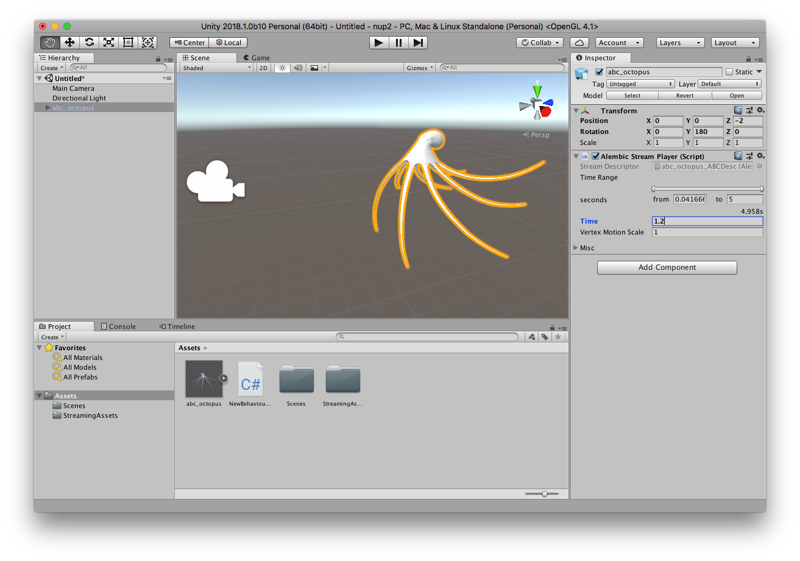
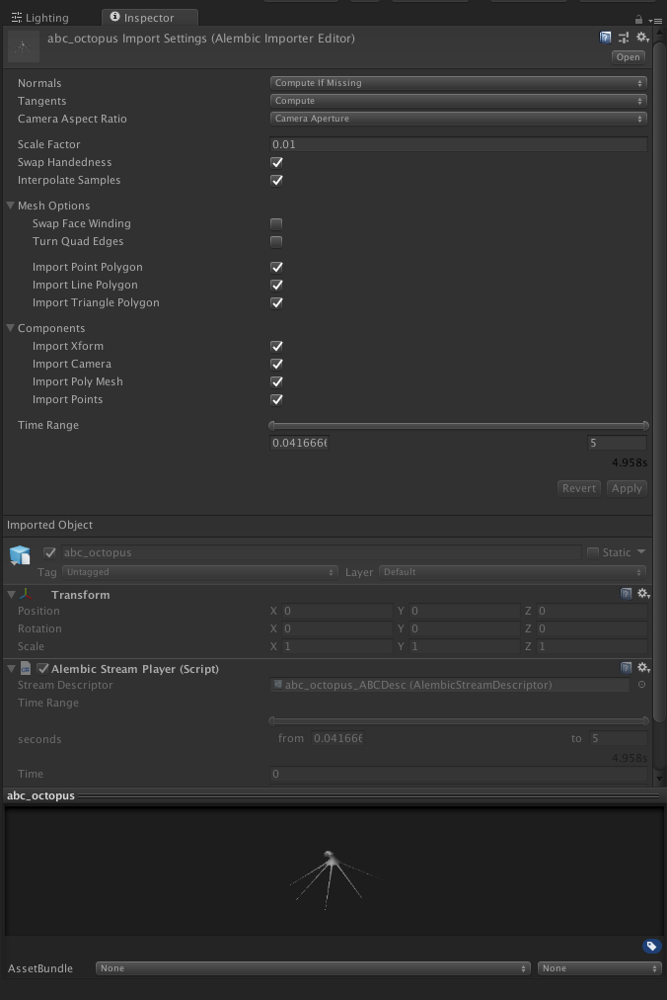
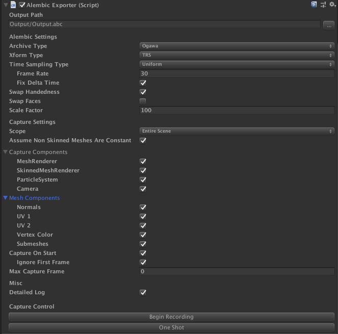
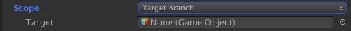
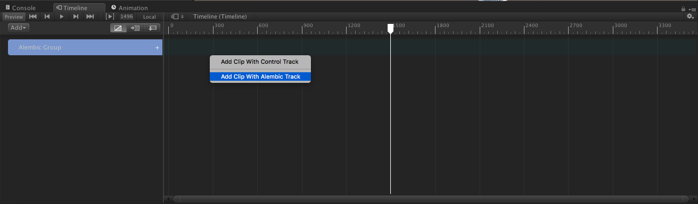
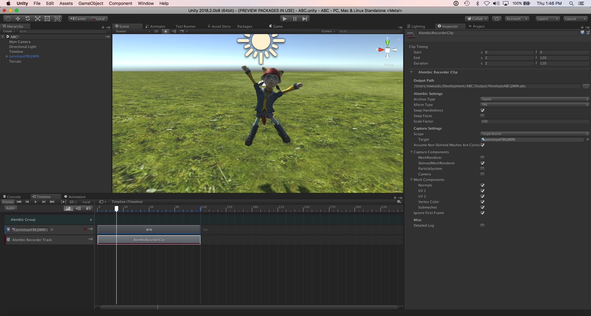
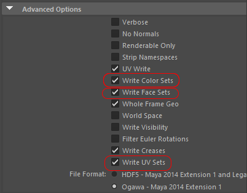

# About the Alembic package

Use the Alembic package to import [Alembic](http://www.alembic.io/) files into your Unity scenes. This lets you bring in vertex cache data, for example facial animation (skinning) and cloth simulation (dynamics), from other software packages and have it playback exactly the same way in Unity.

The Alembic package supports the import and playback of Meshes, Points and Cameras.

## Requirements

The Alembic Package is compatible with Unity Editor 2018.1 and above.

The package is available on 64-bit desktop platforms:
* Microsoft® Windows® 10
* macOS® Sierra (10.12)
* GNU/Linux (CentOS 7, Ubuntu 16.x and Ubuntu 17.x)

## Known Limitations

* There is no exposed public API in the Alembic package

We welcome hearing about your experience on [this forum thread](https://forum.unity.com/threads/alembic-for-unity.521649/).

# Quick start

This is a quick guide to add Alembic assets to your project. By the end you will know how to import and playback Alembic content.

To import Alembic content drag an Alembic file (.abc) into the project view. This will import the Alembic asset.

Then drag the Alembic asset into the scene and scrub the Time property on the Alembic Stream Player component.

To animate using the Timeline Editor first create a Timeline Asset. You can then animate the Alembic Stream Player's Time property using an Infinite clip as shown below. 

Alternatively, you can drag and drop the scene object with the Alembic asset onto an empty area within the Timeline. This will create an Alembic track with an Alembic clip. If you are starting from an empty Timeline you may need to manually create the Alembic track first by right clicking the Timeline's track view on the left hand side of the editor.

# Importing Alembic Files

When you put Alembic files in the Assets folder under your Unity Project, Unity automatically imports and stores them as Unity Assets. To view the import settings in the Inspector, click on the file in the Project window. You can customize how Unity imports the selected file by setting the properties on this window:

| Property:| Function: |
|:---|:---| 
|__Normals__   "Read From File", "Compute If Missing",  "Always Compute",  "Ignore" |Defines whether the normals from the Alembic file are used or if they are calculated based on vertex position. The default "Compute If Missing" will use Alembic file normals if they exist, otherwise it will calculate them. |
|__Tangents__   "Compute"   "None"| If enabled, tangents are computed on import, otherwise no tangent data will be added as the tangents are not stored in Alembic.  **Note:**  - The calculation of tangents requires normals and UV data. If these are missing the tangent cannot be computed.  - The calculation of tangents is expensive, so disable this option if not required in order to increase the speed of playback.|
|__Camera Aspect Ratio__   "Camera Aperture", "Default Resolution", "Current Resolution"| Defines how to set the Unity Camera's aspect ratio. By default the Camera in the Alembic file will determine the aspect ratio. The Alembic Importer can also use the Default Resolution from the Player Settings or the Current Resolution which is defined by the screen. |
|__Scale Factor__ |Set scale factor to convert between different system units. For example, using 0.1 will convert the Alembic units to 1/10 of their value in the resulting Unity GameObject. This also affects position and speed.|
|__Swap Handedness__ | Choose swap handedness to invert the X axis' direction |
|__Interpolate Samples__ | Define whether to interpolate animation. If enabled then the animation will be interpolated for Transform, Camera, and Mesh components for which the topology does not change (i.e. for which the number of vertices and indices are immutable).  If Interpolate Samples is enabled, or velocity data is included in the .abc file, you can pass velocity data to an Alembic shader. 
|__Swap Face Winding__ | Choose swap face winding to invert the orientation of the polygons. |
|__Turn Quad Edges__ | Choose turn quad edge to invert the arrangement of the triangles when the quadrilateral polygon is divided into triangles.|
|__Import Xform__ |Choose whether to import Transform data.|
|__Import Camera__ |Choose whether to import Camera data.|
|__Import Poly Mesh__ |Choose whether to import Mesh data.|
|__Import Points__ |Choose whether to import Point data.|
|__Time Range__ |Defines the start and end frames for the Alembic animation.|

# Exporting Alembic Files

The Alembic exporter supports exporting single frame and multi-frame Alembic files and can export GameObjects with the following components:
* MeshRenderer
* SkinnedMeshRenderer
* ParticleSystem
* Camera

To configure a scene to export an Alembic file, add the AlembicExporter component to a GameObject in the scene. It does not need to be added to the objects being exported, but can be added to an empty object for example.
The component can be configured to export the entire scene or individual object hierarchies.

Using the AlembicExporter component automatically disable Draw Call Batching. If the Mesh group is valid after being batched then it the  will be exported, in some cases the data will be batched multiplied times and the results may change.  If you want to control the Batch settings they can be found in the Rendering section of Player Settings.

The Alembic exporter can be customized by setting the properties on this component:

| Property:| Function: |
|:---|:---| 
|__Output Path__ |Specify the location where the Alembic Exporter will save the Alembic file. By default the output path is relative to the current Unity project path. |
|__Archive Type__ |Choose the Alembic format specification, the default is Ogawa which produces smaller files and better performance than HDF5.|
|__Xform Type__ |Choose the transform type. The default is TRS and records the TRS channels for position, rotation, scale of an object. The alternative is matrix and records the full transformation matrix.|
|__Time Sampling Type__ |Choose between Uniform and Acyclic time sampling. In the case of Uniform, the interval between frames on the Alembic side is always constant (1 / Frame Rate seconds). In the case of Acyclic, the delta time on the Unity side is directly the interval between the frames on the Alembic side. The interval is not constant, but the impact on the game progress will be minimal. It is a mode mainly assuming 3D recording of games.|
|__Time Sampling Frame Rate__ |The frame rate to use for uniform sampling. |
|__Time Sampling Fix Delta Time__ |If enabled, Time.maximumDeltaTime will be set using the frame rate to ensure fixed delta time. In the case of video production this should be the desired behavior. **Note:** be careful if you are managing Time.maximumDeltaTime yourself as this could lead to non-uniform delta time. |
|__Swap Handedness__ |Choose swap handedness to change from a left hand coordinate system (Unity) to a right hand coordinate system (Autodesk® Maya®).|
|__Swap Faces__ |Choose swap faces to reverse the front and back of all faces.|
|__Scale Factor__ |Set scale factor to convert between different system units. For example, using 0.1 will convert the Unity units to 1/10 of their value in the resulting Alembic file. This also affects position and speed.|
|__Capture Scope__ "Entire Scene", "Target Branch" | Choose the scope of the export. By default the entire scene will be exported but it can be configured to export just a branch (or hierarchy) of the scene.  |
|__Assume Non Skinned Meshes Are Constant__ | If enabled, will not capture animation on static meshes. |
|__Capture MeshRenderer__ |Enable to record MeshRenderer components.|
|__Capture SkinnedMeshRenderer__ |Enable to record SkinnedMeshRenderer components.|
|__Capture Particle__ |Enable to record ParticleSystem components.|
|__Capture Camera__ |Enable to record Camera components.|
|__Mesh Components Normals__ |Enable to record mesh normals.|
|__Mesh Components UV1__ |Enable to record mesh UV1.|
|__Mesh Components UV2__ |Enable to record mesh UV2.|
|__Mesh Components Vertex Color__ |Enable to record vertex colors.|
|__Mesh Components Submeshes__ |Enable to record submeshes.|
|__Capture On Start__ |Begin capturing in Start() when scene with AlembicExporter component is loaded.|
|__Ignore First Frame__ |If enabled, do not capture first frame. Only available if **Capture On Start** enabled.|
|__Max Capture Frame__ |The frame to stop capturing at.|
|__Detailed Log__ |Provide detailed Debug logs of each frame that is captured.|
|__Begin Recording__ |In play mode, click button to begin recording. Use if **Capture On Start** is disabled.|
|__One Shot__|Button to export the current frame to the Alembic file.|

> ***Note:*** The current capture target object is determined at the start of capture, and does not change in the middle. Enabling or disabling the object does not affect the capture.
> Also, any objects generated after the start of the capture are not captured.

> ***Note:*** Be careful when deleting the target object in the middle of capture. In this case, the capture of that object will be interrupted, and the Alembic file may have a non-uniform number of samples as a result. Some software may not handle this properly.

> ***Note:*** An ID (e.g. "(0000283C)") is given to the name of the Alembic node on export. This is a measure to avoid name conflicts as Alembic has a rule that each node in a hierarchy should have a unique name. 

## Known Issues

* Material export is currently not supported

# Controlling Alembic playback

The import and playback of Alembic data is controlled by the `Alembic Stream Player` component.

If you change the Time parameter you can see the Objects animate. To play the animation this parameter can be controlled from the Timeline, Animator component or via scripts.

Vertex Motion Scale is a magnification factor when calculating velocity. The greater the velocity and motion scale, the more blurring will be applied by the MotionBlur post processing effect.

You can customize import and playback through the properties on this component:

| Property:| Function: |
|:---|:---| 
|__Time Range__ |Select the range of the imported animation in seconds to be able to play back. By default this is the entire animation.|
|__Time__ |The time in seconds of the animation that is currently displayed on the screen. Scrub or animate this parameter to play the animation. Range of values is from 0 to animation length. |
|__Vertex Motion Scale__ | Set the magnification factor when calculating velocity. Greater velocity means more blurring when used with MotionBlur.|
|__Ignore Visibility__ |Ignore import of animated visibility from the Alembic file when playing|
|__Async Load__ |Select to load file Asynchronously when playing|
|__Recreate Missing Nodes__ |Recreate nodes from the Alembic file that have been deleted from the Unity hierarchy|

> ***Note:*** Please note that copies of .abc files are created under `Assets / StreamingAssets`. This is necessary for streaming data since it requires that the .abc file remain after building the project.

# Using Timeline: Working with Alembic

The Timeline can be used to playback and record Alembic animation including:

* Playback of Alembic animation by controlling the `Alembic Stream Player`
* Create sequences using Alembic clips with the ability to trim times and adjust clip-ins
* Record Alembic data directly from the Timeline to an Alembic file

## Record and playback the Alembic using an `Infinite Clip`

You can control the playback of Alembic using an `Infinite Clip` on a Timeline `Animation Track` bound to the game object with the Alembic Stream Player component. In the recording mode any animatable parameters that are changed will be recorded as an animation source. This infinite clip can then be converted into an Animation Clip which can then be used with the object's Animation State Machine.

## Playback using `Alembic Shot` clips

You can playback Alembic as an `Alembic Shot` on an `Alembic Track`. To create an Alembic Shot drag a scene object with an Alembic Stream Player component on the Clips view portion of the Timeline Editor. If the Timeline editor is empty create an temporary track so that you can see the Clips view portion.

## Recording with the `Alembic Recorder` clip

You can record to Alembic Alembic files using the Alembic Recorder Clip. The following types of components can be recorded:
* Static Meshes (MeshRenderer)
* Skinned Meshes (SkinnedMeshRenderer)
* Particle (ParticleSystem)
* Cameras (Camera)

To configure the Timeline to record an object to Alembic you need to define the scope of the recording. By default the entire scene will be recorded but you can scope it to a hierarchy by setting the root object as a Scope Target in the properties on the Alembic Recorder Clip component:

| Property:| Function: |
|:---|:---| 
|__Output Path__ |Specify the location where the Alembic Exporter will save the Alembic file. By default the output path is relative to the current Unity project path. |
|__Archive Type__ |Choose the Alembic format specification, the default is Ogawa which produces smaller files and better performance than HDF5.|
|__Xform Type__ |Choose the transform type. The default is TRS and records the TRS channels for position, rotation, scale of an object. The alternative is matrix and records the full transformation matrix.|
|__Swap Handedness__ |Choose swap handedness to change from a left hand coordinate system (Unity) to a right hand coordinate system (Autodesk® Maya®).|
|__Swap Faces__ |Choose swap faces to reverse the front and back of all faces.|
|__Scale Factor__ |Set scale factor to convert between different system units. For example, using 0.1 will convert the Unity units to 1/10 of their value in the resulting Alembic file. This also affects position and speed.|
|__Capture Scope__ "Entire Scene", "Target Branch" | Choose the scope of the export. By default the entire scene will be exported but it can be configured to export just a branch (or hierarchy) of the scene.  |
|__Assume Non Skinned Meshes Are Constant__ | If enabled, will not capture animation on static meshes. |
|__Capture MeshRenderer__ |Enable to record MeshRenderer components.|
|__Capture SkinnedMeshRenderer__ |Enable to record SkinnedMeshRenderer components.|
|__Capture Particle__ |Enable to record ParticleSystem components.|
|__Capture Camera__ |Enable to record Camera components.|
|__Mesh Components Normals__ |Enable to record mesh normals.|
|__Mesh Components UV1__ |Enable to record mesh UV1.|
|__Mesh Components UV2__ |Enable to record mesh UV2.|
|__Mesh Components Vertex Color__ |Enable to record vertex colors.|
|__Mesh Components Submeshes__ |Enable to record submeshes.|
|__Ignore First Frame__ |If enabled, do not capture first frame.|
|__Detailed Log__ |Provide detailed Debug logs of each frame that is captured.|

To begin recording press "Play". The Alembic file will be recorded to the output path which by default is relative to the Project Root folder. You can then bring the Alembic file back into the Project and play it back using the Timeline.

# Working with Materials

## Assigning Materials on Import

By default Unity will assign the `Default Material` to imported Alembic Meshes. You will need to manually reassign your Materials for each object.

The Alembic package does not support remapping Face Set names to Materials or creating Materials from Face Set names.

## Alembic Shaders

The Alembic package includes the following Shaders:

| Property:                     | Function: |
|:------------------------------|:----------| 
|__Overlay__                    |Alembic visualization shader. Use it to visualize the normals, tangents, UV Spaces and vertex colors of your mesh. |
|__Points Standard__            |When importing Alembic Point Caches (or using the ones generated when you record a Unity particle system) you can assign a mesh of your choosing to each point to achieve effects such as a flock of birds or falling rubble. For optimization purposes, Alembic Points in Unity use a dedicated, simplified version of the Standard Shader.|
|__Points Transparent__         |With this shader, you can use transparency on meshes acting as Alembic Points and customize both their blending mode and how they interact with the Depth Buffer.|
|__Points Motion Vectors__      |For proper conveyance of motion vectors with Point Caches, Alembic Points components need a dedicated shader. These shaders and their associated materials are created and assigned automatically.|
|__Standard__                   |Standard PBR material with motionblur support added |
|__Standard (Roughness setup)__ |Standard (Roughness setup) PBR with roughness material with motionblur support added |
|__Standard (Specular setup)__   |Standard (Specular setup) material with motionblur support added |

## Motion Blur

The Alembic shaders included add motion vector generation. This is useful for rendering that requires motion vectors, such as the post processing effect MotionBlur. If you want to add the motion vector generation function to your own shader, add the line `UsePass "Hidden / Alembic / MotionVectors / MOTIONVECTORS"` into a SubShader. Please see AlembicMotionVectors.cginc for details. Since the velocity data is passed to the fourth UV, the apex position of the previous frame is calculated based on it. Left is unprocessed, right is output of motion vector and MotionBlur applied by the Post Processing Stack. |

# Working with Autodesk® Maya® 

Autodesk® Maya®'s shading group can be imported as a submesh. Autodesk® Maya® needs to export with "Write Face Sets" option enabled. Please note that this option is off by default.

The Alembic import supports Autodesk® Maya®'s vertex color and multiple UV sets. It is necessary to export from Autodesk® Maya® by setting "Write Color Sets" and "Write UV Sets" option. Please note these are off by default.

To export from Autodesk® Maya® with materials and vertex colors you will need the following highlighted Alembic export settings:

|
