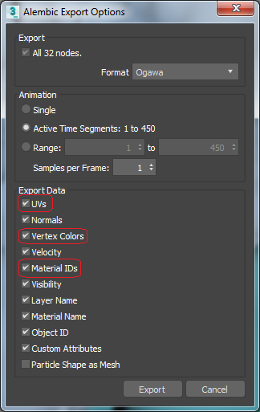

# Creating Alembic files in Autodesk® Maya®

You can import Autodesk® Maya®'s shading group as a sub-Mesh. Before exporting to an Alembic file, enable the **Write Face Sets** option in Autodesk® Maya®, which is disabled by default.

The Alembic package also supports Autodesk® Maya®'s vertex color and multiple UV sets. Before exporting to an Alembic file, enable the **Write Color Sets** and **Write UV Sets** options in Autodesk® Maya®, both of which are disabled by default.

|

# Creating Alembic files in Autodesk® 3ds Max®

The Alembic package also supports Alembic files authored with Autodesk® 3ds Max®. Before exporting, make sure that the **UVs**, **Vertex Colors** and **Material IDs** options are enabled in the *Export Data* section of Autodesk® 3ds Max® Alembic export settings for your Alembic file to support vertex colors and multiple UV sets.

|
