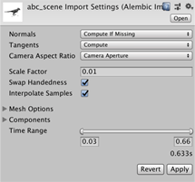
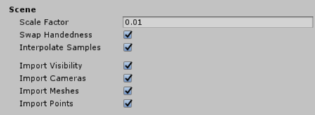
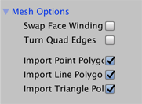

# Alembic Import Settings window

The **Alembic Import Settings (Alembic Importer Editor)** allows you to customize how the Alembic package imports your Alembic file into Unity, including specifying whether or not to include specific components.

The following topics explain the properties of the Alembic Recorder Clip component in detail:

- [Mesh Components options](#importRef_A)
- [Mesh Options option group](#importRef_B)
- [Components option group](#importRef_C)
- [Time range options](#importRef_D)

When you are finished customizing the import options, click **Apply** to proceed or **Revert** to abandon your changes.

## Mesh Components options

Use these options to customize how the Alembic Importer treats the Mesh components, such as normals and tangents.

| ***Property*** || ***Description*** |
|:---|:---|:---|
| __Normals__ || Define whether to use the normals from the Alembic file or if they are calculated based on vertex position. |
|| **Read From File** | Get the normals values from a file. |
|| **Compute If Missing** | Use Alembic file normals if they exist; otherwise the Alembic Importer calculates them. This is the default. |
|| **Always Compute** | Calculate the normals on import. |
|| **Ignore** | Do not consider normal values. |
| __Tangents__ || Determine whether or not tangents are computed on import or not added at all. Tangents are not stored in Alembic, so if you choose not to calculate tangents on import, there will be no tangent data. |
|| **None** | Do not calculate or add tangents at all. Choose this option if you don't need to compute the tangents. Computing tangents is expensive, so choosing this option increases the speed of playback. |
|| **Compute** | Calculate tangents on import. This is the default option for this property. ***Note:*** The calculation of tangents requires normals and UV data. If these are missing, the tangent cannot be computed. |
| __Camera Aspect Ratio__ || Define how to set the Unity Camera's aspect ratio. |
|| **Current Resolution** | Determine the aspect ratio from the current resolution which is defined by the screen. |
|| **Default Resolution** | Determine the aspect ratio from the default resolution defined in the Project Settings window for the Player (under **Edit** > **Project Settings** > **Resolution and Presentation** > **Resolution**). |
|| **Camera Aperture** | Determine the aspect ratio from the Camera in the Alembic file. This is the default. |
| __Scale Factor__ || Set the scale factor to convert between different system units. For example, using 0.1 will convert the Alembic units to 1/10 of their value in the resulting Unity GameObject. This also affects position and speed. |
| __Swap Handedness__ || Enable to invert the X axis' direction. |
| __Interpolate Samples__ || Enable to interpolate animation for Transform, Camera, and Mesh components for which the topology does not change (that is, for which the number of vertices and indices are immutable). If **Interpolate Samples** is enabled, or velocity data is included in the .abc file, you can pass velocity data to an Alembic shader. |

## Mesh Options option group

Use these options to customize how Meshes are imported.

| ***Property*** | ***Description*** |
|:---|:---|
| __Swap Face Winding__ | Enable to invert the orientation of the polygons. |
| __Turn Quad Edges__ | Enable to invert the arrangement of the triangles when the quadrilateral polygon is divided into triangles. |
| __Import Point Polygon__ | Do not use <!-- @TODO Remove this row from the table when the screen shots are updated.--> |
| __Import Line Polygon__ | Do not use <!-- @TODO Remove this row from the table when the screen shots are updated.--> |
| __Import Triangle Polygon__ | Do not use <!-- @TODO Remove this row from the table when the screen shots are updated.--> |

## Components option group

Use these options to customize which components to import from the Alembic file.

| ***Property*** | ***Description*** |
|:---|:---|
| __Import Xform__ | Enable to import Transform data. |
| __Import Camera__ | Enable to import Camera data. |
| __Import Poly Mesh__ | Enable to import Mesh data. |
| __Import Points__ | Enable to import Point (particle cloud) data. |

> ***Note:*** Since Materials are not supported in Alembic, the Alembic package does not import or export Materials.

## Time range options

Enter the start and end frames to define the range of the Alembic animation. 

