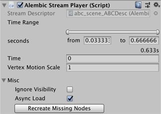

# Alembic Stream Player component

You can customize import and playback through the properties on this component:

| *Property:*                | *Function:*                                                  |
| :------------------------- | :----------------------------------------------------------- |
| __Time Range__             | Select the range of the imported animation in seconds to be able to play back the animation. By default, this includes the entire animation. |
| __Time__                   | Set the time in seconds of the animation that is currently displayed on the screen. This property operates like a playhead control, as you can scrub or animate it to play the animation. Valid values is from 0 to the length of the animation. |
| __Vertex Motion Scale__    | Set the magnification factor when calculating velocity. Greater velocity means more blurring when used with Motion Blur. By default, the value is set to 1 (the velocity is not scaled). |
| __Ignore Visibility__      | Enable this option to ignore (during playback) any animated visibility that may have been imported from the Alembic file. |
| __Async Load__             | Enable this option to load the file asynchronously during playback. |
| __Recreate Missing Nodes__ | Click to recreate nodes from the Alembic file that have been deleted from the Unity hierarchy. |

> ***Note:*** Please note that copies of .abc files are created under `Assets / StreamingAssets`. This is necessary for streaming data since it requires that the .abc file remain after building the project.

