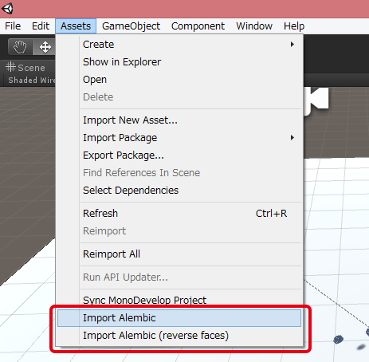
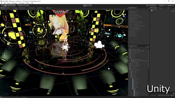
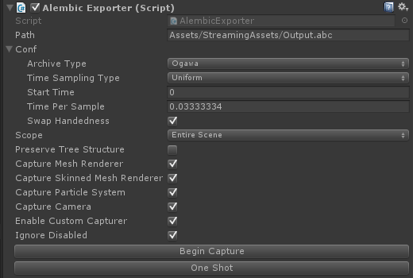

# Alembic Importer / Exporter
[English](https://translate.google.com/translate?sl=ja&tl=en&u=https://github.com/unity3d-jp/AlembicImporter) (by Google Translate)
- [Alembic?](#alembic)
- [Alembic Importer](#alembic-importer)
- [Alembic Exporter](#alembic-exporter)
- [History](#history)

## Alembic?
Alembic は主に映像業界で使われているデータフォーマットで、巨大な頂点キャッシュデータを格納するのに用いられます。  映像業界では、スキニングやダイナミクスなどのシミュレーション結果を全フレームベイクして頂点キャッシュに変換し、それを Alembic に格納してレンダラやコンポジットのソフトウェアに受け渡す、というような使い方がなされます。  
Alembic 本家: http://www.alembic.io/

近年の DCC ツールの多くは Alembic をサポートしており、Alembic のインポートやエクスポートができれば、Unity をレンダリングやコンポジットのツールとして使ったり、Unity で各種シミュレーションを行ってその結果を他の DCC ツールに渡したりといったことができるようになります。ゲームの 3D 録画のような新たな使い方も考えられます。  

本プラグインは Unity で Alembic のインポートとエクスポートを実現します。
現状 Windows 専用で、Unity 5.2 以降で動作を確認済みです。(ソースレベルでは Mac, Linux などでもコンパイルできて動くはずですが、未確認です)  

## Alembic Importer
  
パッケージ: [AlembicImporter.unitypackage](Packages/AlembicImporter.unitypackage?raw=true)

Alembic ファイルのジオメトリを Unity 上で再生するプラグインです。現在 Camera、PolyMesh、Points の再生に対応しています。  
Alembic ファイルに含まれるノード群を Unity 側で GameObject として再構築、PolyMesh を含むノードは MeshFilter や MeshRenderer も生成し、データをファイルからストリーミングして再生します。  
注意すべき点として、**Alembic ファイルは Assets/StreamingAssets 以下に置く必要があります**。これはストリーミングでデータ読み込む都合上、ビルド後も .abc ファイルがそのまま残っている必要があるためです。

上記パッケージをプロジェクトにインポート後、下記スクリーンショットのメニューより Alembic のインポートを行うことができます。  
  

## Alembic Exporter
  
パッケージ: [AlembicExporter.unitypackage](Packages/AlembicExporter.unitypackage?raw=true)

Unity のシーン内のジオメトリを Alembic に書き出すプラグインです。
MeshRenderer, SkinnedMeshRenderer, ParticleSystem (point cache として出力), Camera の書き出しに対応しており、カスタムハンドラを書けば独自のデータも出力できるようになっています。  

エクスポートを行うには、上記パッケージをインポート後、AlembicExporter  コンポーネントを適当なオブジェクトに追加します。
注意すべき点として、**AlembicExporter コンポーネントは追加時に自動的に Batching を無効化します。** 有効なままだと Batching された後の Mesh 群が書き出されてしまい、場合によってはデータが数倍に膨れ上がる上に結果も変わってしまうためです。  
Batching の設定を変えたい場合、設定項目は Edit -> Project Settings -> Player の Rendering 項目の中にあります。  

以下は AlembicExporter の各項目の説明です。

- Output Path  
  出力パスを指定します。  

- Archive Type  
  Alembic のフォーマットの指定です。大抵は Ogawa のままで問題ないと思われます。  

- Time Sampling Type  
  キャプチャの間隔の指定です。
  Uniform にした場合、Alembic 側のフレーム間のインターバルは常に一定 (Time Per Sample 秒) になります。映像制作の場合こちらにすべきでしょう。これを選んでキャプチャを開始した場合した場合、**Time.maxDeltaTime を書き換えてフレームレートを固定します**。Time.maxDeltaTime を独自に管理している場合注意が必要です。  
  Acyclic にした場合、Unity 側のデルタタイムがそのまま Alembic 側のフレーム間のインターバルになります。 当然間隔は一定ではなくなりますが、ゲーム進行への影響は最小限になります。主にゲームの 3D 録画を想定したモードです。  
  Start Time は Alembic 側の開始時間です。Frame Rate は Time Sampling Type が Uniform の場合の Alembic 側のフレーム間インターバルになります。  

- Xform Type  
  特に問題がなければ TRS のままにしておいてください。  
  Xform とは Alembic における Unity の Transform 相当品で、Matrix で保存するとわずかながら再生速度が速くなりますが、ソフトウェアによっては回転とスケールが同時にかかった時結果が元と変わってしまう可能性があります。  

- Swap Handedness  
  有効にすると 右手座標系 / 左手座標系 を入れ変える処理を挟みます。
  DCC ツールの多くは Unity とは逆の座標系なので、大抵は有効にしておいたほうがいいでしょう。  

- Swap Faces  
  面の裏表を反転します。

- Scale  
  単位変換を想定したスケール値で、例えば 0.1 にすると 1/10 サイズに変換して出力します。位置と速度に作用します。  

- Scope  
  Entire Scene の場合文字通りシーン内のキャプチャ可能な全オブジェクトをキャプチャします。
  Current Branch の場合その Alembic Exporter コンポーネントがついている GameObject 以下のツリーのみをキャプチャします。

- Preserve Tree Structure  
  有効にした場合、Unity 側のツリー構造をそのまま Alembic 側でも保ちます (=キャプチャ対象の親オブジェクト群の Transform も Alembic に含めます)。無効の場合、Alembic 側は全要素が Top ノード直下にぶら下がったフラットな構造になります。  
  どちらでも見た目は変わらず、無効の方が情報量は少なくなります。  

- Ignore Disabled  
  これが有効な場合、disabled されたオブジェクトはキャプチャ対象コンポーネントであっても除外されます。

- Capture (コンポーネント名)  
  各コンポーネントのキャプチャの有効/無効を指定します。

- Begin /End Capture, One Shot  
  キャプチャを開始 / 停止します。One Shot は現在の 1 フレームだけをキャプチャします。これらはスクリプトから BeginCapture() / EndCapture() / OneShot() を呼ぶことで同機能にアクセスできます。  

現状キャプチャ対象オブジェクトはキャプチャ開始時に決定され、途中で増減はしません。なので、オブジェクトの enabled / disabled はキャプチャの途中で変わっても影響しませんし、キャプチャ開始後に生成されたオブジェクトはキャプチャされません。  
キャプチャ途中の対象オブジェクトの削除には注意が必要です。この場合そのオブジェクトのキャプチャは中断されますが、その結果できたサンプル数が不均一な Alembic ファイルはややイレギュラーな状態であり、正しく処理できないソフトウェアもあるかもしれません。避けたほうがいいシチュエーションでしょう。  

Alembic 側のノードには名前に "(0000283C)" のような ID が付与されます。これは名前の衝突を避けるための処置です。(Alembic は一つの階層に名前が同じノードが複数あってはいけないルールになっています)  
また、マテリアルは現在全くの未サポートです。

## History
- 2016/01/07
  - [Importer/Exporter] x86 版プラグインを追加
- 2015/12/28
  - [Importer/Exporter] VisualStudio ランタイムへの依存を除去
- 2015/12/25
  - Alembic Exporter 公開
- 2015/06/30
  - Alembic Importer 公開

## Thanks
- Alembic およびそれに付随するライブラリ群 (HDF5, ILMBase) を使用しています。  
  http://www.alembic.io/

## License
MIT-License:

Copyright (C) 2015 Unity Technologies Japan, G.K.

Permission is hereby granted, free of charge, to any person obtaining a copy of this software and associated documentation files (the "Software"), to deal in the Software without restriction, including without limitation the rights to use, copy, modify, merge, publish, distribute, sublicense, and/or sell copies of the Software, and to permit persons to whom the Software is furnished to do so, subject to the following conditions: The above copyright notice and this permission notice shall be included in all copies or substantial portions of the Software.

THE SOFTWARE IS PROVIDED "AS IS", WITHOUT WARRANTY OF ANY KIND, EXPRESS OR IMPLIED, INCLUDING BUT NOT LIMITED TO THE WARRANTIES OF MERCHANTABILITY, FITNESS FOR A PARTICULAR PURPOSE AND NONINFRINGEMENT. IN NO EVENT SHALL THE AUTHORS OR COPYRIGHT HOLDERS BE LIABLE FOR ANY CLAIM, DAMAGES OR OTHER LIABILITY, WHETHER IN AN ACTION OF CONTRACT, TORT OR OTHERWISE, ARISING FROM, OUT OF OR IN CONNECTION WITH THE SOFTWARE OR THE USE OR OTHER DEALINGS IN THE SOFTWARE.
