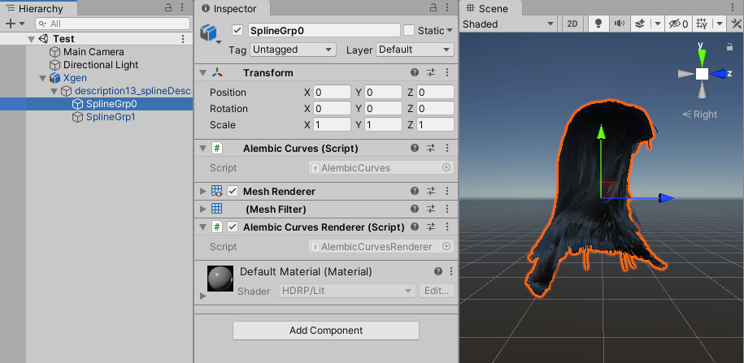

# Working with Curves

You can import Alembic files with curve data to Unity, and optionally preview the curves in your Scene and Game views if you don't have a custom curve renderer.

## Importing Alembic Curve data

To import an Alembic file with curve data, start the Alembic file [import process](import.md), and then in the [import settings](ref_Importer.md), select **Import Curves**.

In the hierarchy of the imported Prefab instance, the Alembic importer adds an **Alembic Curves** component to each GameObject that corresponds to an Alembic curve node, in order to manage the curve data that comes from your Alembic file.

Unity imports the curves as piecewise linear segments, and the imported curve data includes the following attributes:
* Visibility
* vertexPositions
* nVertices
* width
* UV
* Velocities.

>**Note:** The imported curve data does **not** include the spline information from the original Alembic Curve schema.

## Rendering Alembic Curves

Unity does not currently include any built-in curve renderer. This means that, by default, you cannot see the imported curves in the Scene and Game views of your Unity Editor, unless you implemented a custom curve renderer.

However, the Alembic package provides you with a custom basic rendering feature that makes the curves minimally visible in Unity while you are working on your project.

>**Note:** You should only use this option as a temporary preview solution, and keep it disabled if you need to produce a final quality render through your own custom curve renderer.

To enable the basic preview of Alembic curves in Unity, when you configure the [import of Alembic curve data](#importing-alembic-curve-data), also select **Add Curve Renderer**.

In the hierarchy of the imported Prefab instance, the Alembic importer adds three components to each GameObject that corresponds to an Alembic curve node, in addition to the **Alembic Curves** component:
* A **Mesh Renderer** component
* A **Mesh Filter** component
* An **Alembic Curves Renderer** component, which maps the curve data of the **Alembic Curves** component with the rendered mesh.

 _Example of imported curves with the basic rendering option enabled for preview purposes._
