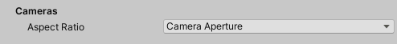

Use these options to customize which components to import from the Alembic file.

| Property || Description |
|:---|:---|:---|
| __Camera Aspect Ratio__ || Define how to set the Unity Camera's aspect ratio. |
|| Current Resolution | Determine the aspect ratio from the current resolution which is defined by the screen. |
|| Default Resolution | Determine the aspect ratio from the default resolution defined in the Project Settings window for the Player (under **Edit** > **Project Settings** > **Resolution and Presentation** > **Resolution**). |
|| Camera Aperture | Determine the aspect ratio from the Camera in the Alembic file. This is the default. |

> ***Note:*** Since Materials are not supported in Alembic, the Alembic package does not import or export Materials.
