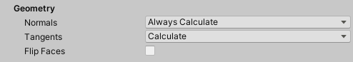

Use these options to customize how Meshes are imported.

| Property || Description |
|:---|:---|:---|
| __Normals__ || Define whether to use the normals from the Alembic file, or to calculate them based on vertex position. |
|| Calculate If Missing | Use Alembic file normals if they exist; otherwise the Alembic Importer calculates them. This is the default. |
|| Always Calculate | Calculate the normals on import. |
| __Tangents__ || Determine whether or not tangents are computed on import or not added at all. Tangents are not stored in Alembic, so if you choose not to calculate tangents on import, there will be no tangent data. |
|| None | Do not calculate or add tangents at all. Choose this option if you don't need to compute the tangents. Computing tangents is resource-intensive, so choosing this option increases the speed of playback. |
|| Calculate | Calculate tangents on import. This is the default option for this property. **Note:** The calculation of tangents requires normals and UV data. If these are missing, the tangent cannot be computed. |
| __Flip Faces__ || Enable to invert the orientation of the polygons. |
