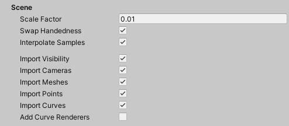

Use these options to customize the scale factor, handedness, interpolation, and which components to import from the Alembic file.

| Property | Description |
|:---|:---|
| __Scale Factor__ | Set the scale factor to convert between different system units. For example, using 0.1 converts the Alembic units to 1/10 of their value in the resulting Unity GameObject. This also affects position and speed. |
| __Swap Handedness__ | Enable to invert the X axis' direction. |
| __Interpolate Samples__ | Enable to interpolate animation for Transform, Camera, and Mesh components for which the topology does not change (that is, for which the number of vertices and indices are immutable). If **Interpolate Samples** is enabled, or velocity data is included in the .abc file, you can pass velocity data to an Alembic shader. |
| __Import Visibility__ | Enable to import Visibility (i.e. the control of the active state of the objects). |
| __Import Camera__ | Enable to import Camera data. |
| __Import Meshes__ | Enable to import Mesh data. |
| __Import Points__ | Enable to import Point (particle cloud) data. |
| __Import Curves__ | Enable to import Curve (hair or fur) data. See [Working with Curves](curves.md) for more details. |
| __Add Curve Renderers__ | Enable to get a [basic preview](curves.md#rendering-alembic-curves) of the Alembic curves in your Scene and Game views if you don't have a curve renderer. This option is only available when you select __Import Curves__. |
