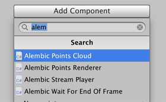

# Alembic for Unity

Use the Alembic package to import and export [Alembic](http://www.alembic.io/) files into your Unity Scenes, where you can playback and record animation directly in Unity. The Alembic format bakes animation data into a file so that you can stream the animation in Unity directly from the file. This saves a significant amount of resources, because the modeling and animating does not happen directly inside Unity.

The Alembic package brings in vertex cache data from a 3D modeling software, such as facial animation (skinning) and cloth simulation (dynamics). When you play it back inside Unity, it looks exactly the same as it did in the 3D modeling software.

## Overview

The Alembic package supports these features:

- [Importing](import.md) data from Meshes, Particle Cloud Points, and Cameras.
- Applying [Alembic Shaders](matshad.md#shaders) and [Motion Blur](matshad.md#blur) effects.
- Customizing [particle and point cloud effects](particles.md).
- Playing animation by streaming data through [Timeline](timeline.md) or [Unity Animation](animClip.md).
- Playing Alembic animation [using imported animation clips](time_ImportedClip.md).
- [Exporting](export.md) Unity GameObjects to an Alembic file.

## Requirements

The Alembic Package is compatible with Unity Editor 2018.1 and above.

The package is available on these 64-bit desktop platforms:
* Microsoft® Windows® 10
* macOS® Sierra (10.12)
* GNU/Linux (CentOS 7, Ubuntu 16.x and Ubuntu 17.x)

## Known limitations

* Alembic does not support Material import and export.
* There is no exposed public API in the Alembic package.

## Feedback

Tell Unity about your experience using Alembic for Unity on [the Alembic-For-Unity forum](https://forum.unity.com/threads/alembic-for-unity.521649/).

## Installation

To install this package, follow the instructions in the [Package Manager documentation](https://docs.unity3d.com/Packages/com.unity.package-manager-ui@latest).

To verify that the Alembic package is correctly installed, try to add an Alembic component to a GameObject or Camera:

1. Select a GameObject or Camera and open the Inspector view.

2. Click the **Add Component** button and search for **alem**.

   If it installed properly, you can see some Alembic components in the list:

   
