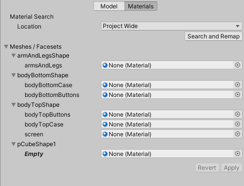
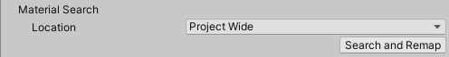

# Working with Materials

The Alembic format doesn't support any material data. Thus, when you import an Alembic file in Unity, the resulting imported asset can't have specific materials assigned by default to its submeshes.

To guarantee an acceptable basic display of the imported Alembic asset, Unity first assigns the whole asset a [default material](#default-material-assignation-and-re-mapping). Then, you can re-map all its submeshes with specific materials of your project, according to your rendering needs.

**Note:** The instructions on this page only apply to Alembic files imported [via your project folder](import-file-local.md). They don't apply to Alembic files you would have added to a Scene [via an external link](import-file-external.md).

## Default material assignation and re-mapping

By default, when you import an Alembic file, Unity automatically assigns all of its submeshes the **Default Material** corresponding to your project's render pipeline.

If you need to re-map the imported submeshes with custom materials, you can do it directly from the Importer Settings window:
* [Automatically](#automatic-re-mapping-based-on-face-set-names) with materials of your project you would have named after the Face Sets of the original Alembic file.
* [Manually](#manual-assignation) with any materials of your project.

## Automatic re-mapping based on Face Set names

To automatically search and assign materials based on Alembic Face Set names:

1. Make sure to create all necessary materials in your project, and name them after the Face Sets of the original Alembic file.

2. Select the Alembic asset in the Project window.

3. In the Inspector, in the Import Settings window, select [the **Materials** tab](ref_Importer.md#materials).

   

4. In the **Material Search** section, select a **Location** to adjust the material search scope.

   

5. Click on **Search and Remap**.

6. In the **Meshes / Face Sets** list, review the material override field changes, and click on **Apply**.

**Note:** If a material override field remains set to "None (Material)", you can still [assign it a material manually](#manual-assignation). Otherwise, the Default Material assignation continues to apply to the submesh.

## Manual assignation

To manually assign materials of your project to the imported Alembic asset submeshes:

1. Select the Alembic asset in the Project window.

2. In the Inspector, in the Import Settings window, select [the **Materials** tab](ref_Importer.md#materials).

   

3. In the **Meshes / Face Sets** list, use the target fields to override the default material submesh assignations.

   **Note:** If you leave a material override field set to "None (Material)", the Default Material assignation continues to apply to the submesh.

4. Click on **Apply**.
