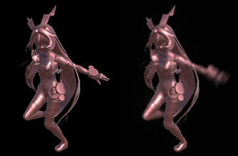

# Applying motion blur and shaders

This section contains information about how to set up [Motion Blur](#blur). It also lists the [Shaders](#shaders) included in this package and specifically customized to work with Alembic.


<a name="shaders"></a>

## Alembic Shaders

The Alembic package includes the following Shaders:

| *Shader:*              | *Description:* |
|:------------------------------|:----------|
|__Overlay__                    |Alembic visualization Shader. Use it to visualize the normals, tangents, UV spaces and vertex colors of your Mesh. |
|__Points Standard__            |When importing Alembic Point Caches (or using the ones generated when you record a Unity particle system), you can assign a Mesh of your choice to each Point to achieve effects such as a flock of birds or falling rubble. <br/>For optimization purposes, when Unity imports Alembic Points, it applies this Shader, which is a dedicated, simplified version of the **Standard** Shader.|
|__Points Transparent__         |With this Shader, you can use transparency on Meshes acting as Alembic Points, and customize both their blending mode and how they interact with the Depth Buffer.|
|__Points Motion Vectors__      |For proper conveyance of motion vectors with Point Caches, Alembic Points components need a dedicated Shader. Unity creates and assigns these Shaders and their associated Materials automatically.|
|__Standard__                   |Standard Physically Based Renderer (PBR) Material with Motion Blur support added. |
|__Standard (Roughness setup)__ |Standard PBR Roughness Material with Motion Blur support added. |
|__Standard (Specular setup)__   |Standard Specular Material with Motion Blur support added. |


<a name="blur"></a>

## Motion Blur

Although Unity generates motion vectors for Mesh Renderers and Skinned Mesh Renderers, the Alembic Shaders add motion vector support to Alembic files only. This is useful for rendering that requires motion vectors, such as the Motion Blur post processing effect.

|

In the above image, on the left the character is unprocessed. On the right you can see the output of motion vector and Motion Blur applied by the post processing stack.

If you want to add the motion vector generation function to your own Shader, add this line inside a SubShader:

```c++
UsePass "Hidden / Alembic / MotionVectors / MOTIONVECTORS"
```

Because the velocity data is passed to the fourth UV, Unity uses this data to calculate the apex position of the previous frame. See *AlembicMotionVectors.cginc* for the **MotionVectorData** struct.
