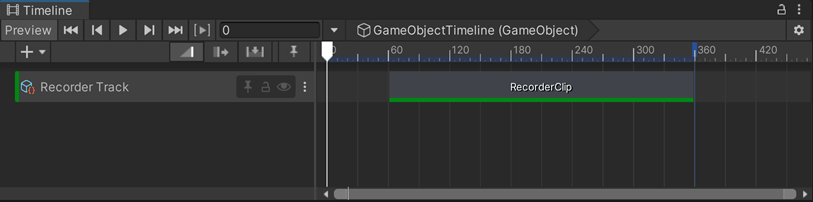
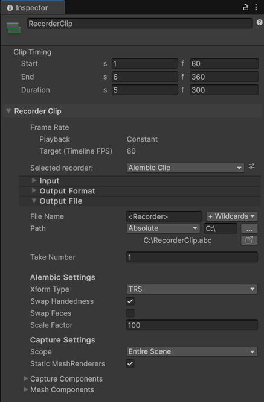

# Record to Alembic with a Timeline Recorder Track

Set up one or multiple Recorder clips in a Timeline Recorder Track to activate the recording of a GameObject's animations to Alembic at specific time or frame intervals in Play mode.

>[!NOTE]
>This scenario requires to have both the [Recorder](https://docs.unity3d.com/Packages/com.unity.recorder@latest) and [Timeline](https://docs.unity3d.com/Packages/com.unity.timeline@latest) packages installed in addition to the Alembic package.

To record to Alembic through a Timeline Recorder Track:

1. Open the Timeline where you want to set up the Recorder Track.

1. In the Timeline window, click on the Add (**+**) button and select **UnityEditor.Recorder.Timeline** > **Recorder Track**.

1. Right-click in the **Recorder Track** you just added and select **Add Recorder Clip**.

   

1. Select the added **Recorder Clip**, and in the Inspector, in the **Selected recorder** dropdown list, select **Alembic Clip**.

   

1. In **Capture Settings**, specify the targeted export scope and the type of data you want to export.

1. In **Alembic Settings**, specify the ways to output the data as an Alembic file.

1. Adjust the clip timing according to the time or frame interval you need to record the Alembic clip in.

1. Set up the other [Alembic Clip Recorder properties](ref_Recorder.md) according to your needs.

1. To start the recording, enter Play mode.

The Alembic Clip Recorder clip starts and stops according to the clip timing you've set up in Timeline and the Recorder saves the animation to an Alembic file in the folder specified in **Output File** > **Path**.

## Additional resources

* [Recorder package documentation](https://docs.unity3d.com/Packages/com.unity.recorder@latest)
* [Timeline package documentation](https://docs.unity3d.com/Packages/com.unity.timeline@latest)
* [Alembic Clip Recorder properties](ref_Recorder.md)
