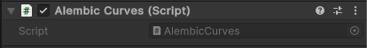

# Alembic Curves component

The Alembic Curves component describes an Alembic curve node.

| *Property*        | *Function*                                                               |
| :---------------- | :----------------------------------------------------------------------- |
| **Script**        | The script that defines this component. You cannot modify this property. |

[This tutorial](curves.md) explains how to use Alembic Curves in more detail.
