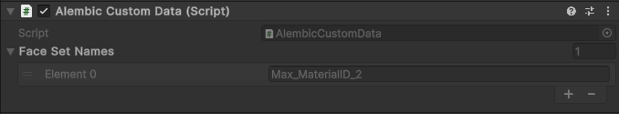

# Alembic Custom Data component

The Alembic Custom Data component displays additional custom information stored with each Face Set. A Face Set is a sub-group of faces that compose an object.

To access the Custom Data component, select a child node of an imported Alembic asset in your scene hierarchy. If there is any additional data associated with the object, the component will be added automatically. The absence of the Custom Data component means there is no custom data associated with an object.

| ***Property*** | ***Description*** |
|:---|:---|
| **Script**        | The script that defines this component. You cannot modify this property. |
| **Face Set Names** | Names of the Face Sets that compose the selected object. |
| **Element**        | The custom data associated with a Face Set.                |

It is important to note that the Custom Data component is read-only. As such, it cannot be used to add custom data to an object.
