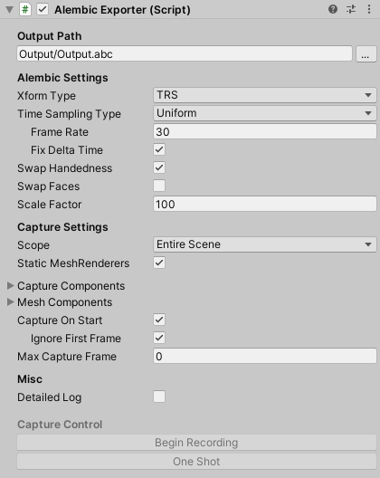
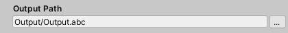
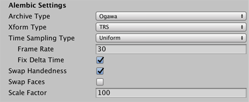
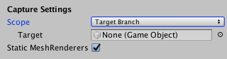
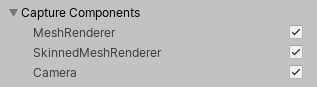
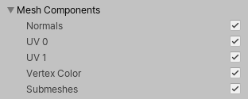
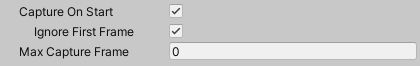
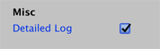
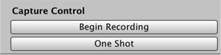

# Alembic Exporter component

The Alembic Exporter component allows you to customize how the Alembic package exports animation to an Alembic file.

The following topics describe the properties of the Alembic Exporter component in detail:

- [**Output Path** section](#exportRef_A)
- [**Alembic Settings** section](#exportRef_B)
- [**Capture Settings** section](#exportRef_C)
- [**Capture Components** option group](#exportRef_D)
- [**Mesh Components** option group](#exportRef_E)
- [More Capture options](#exportRef_F)
- [**Misc** section](#exportRef_G)
- [**Capture Control** section](#exportRef_H)

> ***Note:*** The Alembic package appends an ID (for example, `(0000283C)`) to the name of the Alembic node on export. This is to avoid naming conflicts, because Alembic forces each node in a hierarchy to have a unique name.

## Output Path section

Specify the location to save the Alembic file to. By default, the output path is relative to the current Unity Project path.

## Alembic Settings section

Use these settings to define the properties of the Alembic output.

| ***Property***      |             | ***Description***                                            |
| :------------------ | :---------- | :----------------------------------------------------------- |
| __Xform Type__      |             | Choose the transform type.                                   |
|                     | __Matrix__  | Record the full transformation matrix.                       |
|                     | __TRS__     | Record the TRS channels for position, rotation, scale of an object. This is the default transform type. |
| *__Time Sampling__* |             |                                                              |
| __Type__            |             | Choose the time sampling mode.                               |
|                     | __Uniform__ | The interval between frames on the Alembic side is always constant (`1 / Frame Rate seconds`). |
|                     | __Acyclic__ | The delta time in Unity is the interval between the frames on the Alembic side. The interval is not constant, but the impact on the game progress is minimal. It is a mode mainly assuming 3D recording of games. |
| __Frame Rate__      |             | Set the frame rate to use for uniform sampling. This option is only available when Time Sampling **Type** is set to Uniform. |
| __Fix Delta Time__  |             | Enable this option to set [Time.maximumDeltaTime](https://docs.unity3d.com/ScriptReference/Time-maximumDeltaTime.html) using the frame rate to ensure fixed delta time. In the case of video production, this is the desired behavior. ***Note:*** If you are managing [Time.maximumDeltaTime](https://docs.unity3d.com/ScriptReference/Time-maximumDeltaTime.html) yourself, be aware that this could lead to non-uniform delta time.  This option is only available when Time Sampling **Type** is set to Uniform. |
| __Swap Handedness__ |             | Enable to change from a left hand coordinate system (Unity) to a right hand coordinate system (Autodesk® Maya®). |
| __Swap Faces__      |             | Enable to reverse the front and back of all faces.           |
| __Scale Factor__    |             | Set scale factor to convert between different system units. For example, using 0.1 converts the Unity units to 1/10 of their value in the resulting Alembic file. This also affects position and speed. |

## Capture Settings section

Use these settings to determine the set of target GameObject(s) for the current capture. Once the capture begins, the target set is locked and does not change. Enabling or disabling a GameObject in the target set does not affect the capture. Any GameObjects generated after the start of the capture are not included.

> ***Warning:*** Deleting a target GameObject in the middle of a capture interrupts the capture, and the Alembic file might have a non-uniform number of samples as a result. Some software might not handle this properly.

| ***Property*** || ***Description*** |
| :--- | :--- | :--- |
| __Scope__ || Choose the scope of the export. By default, this is set to the **Entire Scene**. |
|| __Entire Scene__  | Export the entire Scene. This is the default. |
|| __Target Branch__ | Export only a branch (or hierarchy) of the Scene. When you choose this option, the **Target** property appears, which allows you to select a GameObject. |
| __Target__ || Set a reference to the GameObject that is the root of the hierarchy you want to export. This property is only available if the **Scope** property is set to __Target Branch__. |
| __Static MeshRenderers__ || Enable this option to skip capturing animation on static Meshes. |

## Capture Components option group

Use these settings to define which components to save data for.

| ***Property***          | ***Description***                                            |
| :---------------------- | :----------------------------------------------------------- |
| __MeshRenderer__        | Enable to export [MeshRenderer](https://docs.unity3d.com/Manual/class-MeshRenderer.html) components. |
| __SkinnedMeshRenderer__ | Enable to export [SkinnedMeshRenderer](https://docs.unity3d.com/Manual/class-SkinnedMeshRenderer.html) components. |
| __Camera__              | Enable to export [Camera](https://docs.unity3d.com/Manual/class-Camera.html) components. |

## Mesh Components option group

Use these settings to fine-tune the Mesh data you are saving.

| ***Property***   | ***Description***               |
| :--------------- | :------------------------------ |
| __Normals__      | Enable to export Mesh normals.  |
| __UV 0__         | Enable to export the base texture coordinates of the Mesh.|
| __UV 1__         | Enable to export the second texture coordinate set of the Mesh.|
| __Vertex Color__ | Enable to export vertex colors. |
| __Submeshes__    | Enable to export sub-Meshes.    |

> ***Note:*** Alembic does not support Material export, and therefore neither does Alembic in Unity.

## More Capture options

These options allow you to control starting and stopping the capture.

| ***Property***         | ***Description***                                            |
| :--------------------- | :----------------------------------------------------------- |
| __Capture On Start__   | Enable to begin capturing in [Start()](https://docs.unity3d.com/ScriptReference/MonoBehaviour.Start.html) when a Scene with an [AlembicExporter](ref_Exporter.md) component is loaded. |
| __Ignore First Frame__ | Enable to skip capturing the first frame.  Only available if **Capture On Start** is enabled. |
| __Max Capture Frame__  | Set the frame to stop capturing at.                          |

## Misc section

Enable the __Detailed Log__ option to provide Debug logging for each captured frame.

## Capture Control section

The buttons in this section allow you to define how much of the animation to capture.

>**Note:** The buttons of this section are usable only once you enter the Play mode.

In Play mode, click __Begin Recording__ to start capturing the entire Scene. Use this option if **Capture On Start** is disabled.

To export only the current frame to the Alembic file, click __One Shot__.
