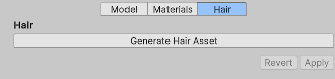

The Hair tab helps you generate a groom from the imported Alembic file.

### Generate Hair Asset

This button generates a Hair Asset based on the imported Alembic asset. For this, your Alembic asset must include curves data.
