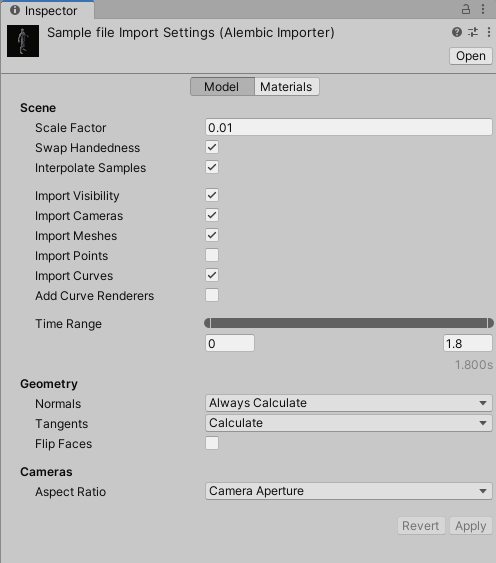

# Alembic Import Settings window

The Alembic **Import Settings (Alembic Importer)** window allows you to customize the import of an Alembic file that is located in a folder within your Unity project.
>**Note:** If you need to customize the import of an alembic file that is located outside your project, use the [Stream Player component](ref_StreamPlayer.md#alembic-asset-located-outside-your-project).

To access the Import Settings window, select the Alembic file in your Project window.

The following topics explain the properties of the Alembic Import Settings window in detail:

- [Scene options](#scene-options)
- [Geometry options](#geometry-options)
- [Cameras options](#cameras-options)
- [Time range options](#time-range-options)

## Apply/Revert buttons

If you change properties in the **Import Settings (Alembic Importer)** window, the Alembic Importer does not take them into account until you manually apply them.

| Button | Function |
| :--- | :--- |
| **Apply** | Applies all changes to allow the Alembic Importer to take them into account in the import process. |
| **Revert** | Abandons any changes you might have done in the window. This reverts all property values to their previous state and has no impact on the current import process. |

>**Note:** If these buttons are inactive, it means that the Alembic Importer currently uses the import options as seen in the window.

## Scene options

[!include]

## Geometry options

[!include]

## Cameras options

[!include]

## Time range options

Select the time range that corresponds to the portion of the animation you want to be able to play back in Unity. By default, this includes the entire animation.

To change the time range, either drag the handles or directly enter the start and end values in seconds.
