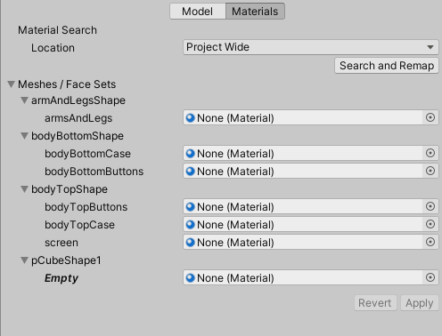
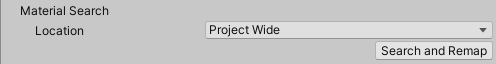
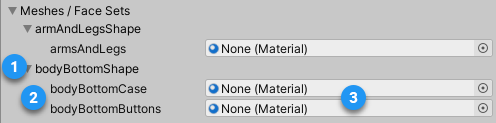

# Alembic Import Settings window

The Alembic **Import Settings (Alembic Importer)** window allows you to customize the import of an Alembic file that is located in a folder within your Unity project.
>**Note:** If you need to customize the import of an alembic file that is located outside your project, use the [Stream Player component](ref_StreamPlayer.md#alembic-asset-located-outside-your-project).

To access the Import Settings window, select the Alembic file in your Project window.

The Import Settings window consists of two tabs:

- [Model](#model): to customize the Alembic file import through Scene, Time, Geometry and Camera options.
- [Materials](#materials): to map the submeshes of the imported Alembic asset with existing materials of your project.

**Note:** These two tabs share the same [**Apply** and **Revert** buttons](#apply-and-revert-buttons).

## Model

The Model tab allows you to set up the following import options for your Alembic file:

- [Scene options](#scene-options)
- [Time Range options](#time-range-options)
- [Geometry options](#geometry-options)
- [Cameras options](#cameras-options)

### Scene options

[!include]

### Time Range options

Select the time range that corresponds to the portion of the animation you want to be able to play back in Unity. By default, this includes the entire animation.

To change the time range, either drag the handles or directly enter the start and end values in seconds.

### Geometry options

[!include]

### Cameras options

[!include]

## Materials

The Materials tab helps you assign existing materials of your project to any submesh of the imported Alembic file. You can assign these materials manually, or map them automatically based on the Face Set names of the original Alembic file.

### Material Search

This section of the Materials tab allows you to automatically assign materials to submeshes of the imported Alembic asset. For this, your project must already include materials named after the Face Sets of the original Alembic file.

| Property/button |  | Description |
|:---|:---|:---|
| **Location** |  | Defines the location in which to search for existing materials in your project. |
|  | Project Wide | Sets the search scope to all folders of your project. |
|  | Current Folder | Sets the search scope to the folder where the imported Alembic asset is located. This includes subfolders. |
| **Search and Remap** |  | Searches for existing materials in the specified **Location**, and automatically maps the submeshes of the imported Alembic asset with materials having the same name, if they exist.  **Note:** This process is case insensitive. |

### Meshes / Face Sets

This section of the Materials tab lists all meshes and submeshes of the imported Alembic asset, with their current material assignation status.

| Label | Description |
|:---|:---|
| (1) | A mesh of the imported Alembic asset.  **Note:** The Meshes / Face Sets treeview does not represent the actual GameObject hierarchy of the imported Alembic asset. To get hierarchy context for a specific mesh, place your mouse cursor over the mesh name. |
| (2) | Submeshes of mesh (1), identified by the names of their corresponding Face Sets in the original Alembic file.  **Note:** "Empty" means the corresponding Face Set has no name in the original Alembic file. In that case, you can only assign a material manually. |
| (3) | The current material override status of the submesh.  Use the target fields to manually assign materials to the listed submeshes. For automatic name-based material assignation, use [Material Search](#material-search).  **Note:** "None (Material)" means the Alembic Importer still assigns the Default Material to the submesh. |

## Apply and Revert buttons

If you change properties in any tab of the **Import Settings (Alembic Importer)** window, the Alembic Importer does not take them into account until you manually apply them.

| Button | Function |
| :--- | :--- |
| **Apply** | Applies all changes you made in both the **Model** and **Materials** tabs for the current imported Alembic asset. |
| **Revert** | Abandons any changes you might have done in any of the **Model** and **Materials** tabs. This reverts all property values to their previous state and has no impact on the current imported Alembic asset in Unity. |

>**Note:** If these buttons are inactive, it means that the Alembic Importer currently uses the import options as seen in the window.
