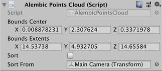

# Alembic Point Cloud component

The **Alembic Point Cloud** component allows you to define the shape and volume of the particle's point cloud.

| ***Property*** | ***Description*** |
|:---|:---|
| **Bounds Center** | Set the position in **X**, **Y**, and **Z** for the center of the particle cloud. |
| **Bounds Extents** | Set the bounding limit for the particle cloud. Each **X**, **Y**, and **Z** value defines the maximum distance between the **Bounds Center** value and the extents of the bounding box (AABB). For more information, see the [Bounds struct reference page in the Unity manual](https://docs.unity3d.com/ScriptReference/Bounds.html). |
| **Sort** | Check to enable particle sorting. Particle sorting allows you to set realistic particle effects by defining the order in which Unity renders particles. For example, the particles that are drawn last overlay the particles that were drawn earlier. |
| **Sort From** | Set the point of reference for sorting particles. For example, if you select a camera, Unity renders the particles furthest away from that camera first, so that the closest particles to the camera overlay the others. |
