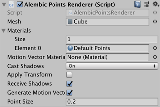

# Alembic Point Renderer component

The **Alembic Point Renderer** component allows you to customize the appearance of the points.

| ***Property*** || ***Description*** |
|:---|:---|:---|
| **Mesh** || Set a reference to the Mesh that you want to use as the shape for each particle. Defaults to the Cube shape. |
| ***Materials*** |||
| **Size** || Set the number of different Materials to use for points. For example, to use a fire Material for some of the particles and a smoke Material for the rest, enter **2**.  A corresponding number of **Element** properties appear below this option.  Defaults to 0. |
| **Element <number>** || Set a reference to the Material you want to use for rendering the points in the particle cloud. Only available if the **Size** option is set to a number greater than 0. |
| **Motion Vector Material** || Set the Material used for motion vectors (trails) if the **Generate Motion Vector** option is enabled. |
| **Cast Shadows** || Define whether points should cast shadows and if so, how. |
|| **On** | Choose this option to cast a shadow. |
|| **Off** | Don't cast a shadow. |
|| **Two Sided** | Cast a shadow on two sides. |
|| **Shadows Only** | Render the shadow but don't render the point itself. |
| **Apply Transform** || Enable to apply previous transform of particles to MaterialPropertyBlock vector at end of each update. Otherwise, reset the transform. |
| **Receive Shadows** || Enable to have points receive shadows. |
| **Generate Motion Vector** || Enable to generate motion vectors for points. |
| **Point Size** || Set the size of points in meters. |
