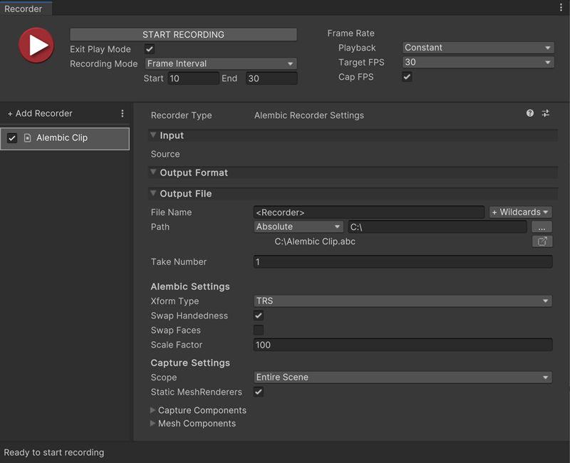

# Alembic Clip Recorder properties

This section covers all properties specific to the Alembic Clip Recorder type.

> **Note:**
> * You must install the [Unity Recorder](https://docs.unity3d.com/Packages/com.unity.recorder@latest/index.html) package (minimum version: 2.0.0) to use the Alembic Clip Recorder.
> * To fully configure an Alembic Clip Recorder, you must also set the global Recording Properties for the capture (properties shared with the other recorders, such as the frames to record). The [Unity Recorder documentation](https://docs.unity3d.com/Packages/com.unity.recorder@latest/index.html) describes these properties in detail.

The Alembic Clip Recorder properties fall into three main categories:
* [Output File](#output-file)
* [Alembic Settings](#alembic-settings)
* [Capture Settings](#capture-settings)

## Output File

Use this section to specify the output **Path** and **File Name** pattern to save the recorded images.

> **Note:** Output File properties work the same for all types of recorders. The [Unity Recorder documentation](https://docs.unity3d.com/Packages/com.unity.recorder@latest/index.html) describes these properties in detail.

## Alembic Settings

Use this section to define the properties of the Alembic output.

| Property || Description |
| :--- | :--- | :--- |
| __Xform Type__ || Choose the transform type. |
|| Matrix | Record the full transformation matrix. |
|| TRS | Record the TRS channels for position, rotation, scale of an object. This is the default transform type. |
| __Swap Handedness__ || Enable to change from a left hand coordinate system (Unity) to a right hand coordinate system (Autodesk® Maya®). |
| __Swap Faces__ || Enable to reverse the front and back of all faces. |
| __Scale Factor__ || Set scale factor to convert between different system units. For example, using 0.1 converts the Unity units to 1/10 of their value in the resulting Alembic file. This also affects position and speed. |

## Capture Settings

Use this section to determine the set of target GameObject(s) for the current capture. Once the capture begins, the target set is locked and does not change. Enabling or disabling a GameObject in the target set does not affect the capture. Any GameObjects generated after the start of the capture are not included.

> **Warning:** Deleting a target GameObject in the middle of a capture interrupts the capture, and the Alembic file might have a non-uniform number of samples as a result. Some software might not handle this properly.

| Property || Description |
| :--- | :--- | :--- |
| __Scope__ || Choose the scope of the export. By default, this is set to the **Entire Scene**. |
|| Entire Scene  | Export the entire Scene. This is the default. |
|| Target Branch | Export only a branch (or hierarchy) of the Scene. When you choose this option, the **Target** property appears, which allows you to select a GameObject. |
| __Target__ || Set a reference to the GameObject that is the root of the hierarchy you want to export. This property is only available if the **Scope** property is set to __Target Branch__. |
| __Static MeshRenderers__ || Enable this option to skip capturing animation on static Meshes. |

### Capture Components

Use these settings to define which components to save data for.

| Property | Description |
| :--- | :--- |
| __MeshRenderer__ | Enable to export [MeshRenderer](https://docs.unity3d.com/Manual/class-MeshRenderer.html) components. |
| __SkinnedMeshRenderer__ | Enable to export [SkinnedMeshRenderer](https://docs.unity3d.com/Manual/class-SkinnedMeshRenderer.html) components. |
| __Camera__ | Enable to export [Camera](https://docs.unity3d.com/Manual/class-Camera.html) components. |

### Mesh Components

Use these settings to fine-tune the Mesh data you are saving.

| Property | Description |
| :--- | :--- |
| __Normals__      | Enable to export Mesh normals.  |
| __UV 0__         | Enable to export the base texture coordinates of the Mesh.|
| __UV 1__         | Enable to export the second texture coordinate set of the Mesh.|
| __Vertex Color__ | Enable to export vertex colors. |
| __Submeshes__    | Enable to export sub-Meshes.    |

> **Note:** Alembic does not support Material export, and therefore neither does Alembic in Unity.
