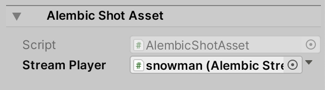

# Alembic Shot Asset component

The Alembic Shot Asset component allows you to customize where to stop playback of the Alembic Shot clip:

| *Property:*       | *Function:*                                                  |
| :---------------- | :----------------------------------------------------------- |
| __Script__        | The script that defines this component. You cannot modify this property. |
| __Stream Player__ | Set a reference to the [Alembic Stream Player](ref_StreamPlayer.md) that this component is linked to. By default this property is already set. |
| __End Offset__    | Enter the number of seconds to clip from the end of Alembic Asset while playing back. This can be a positive or negative number. The default value is 0. |
