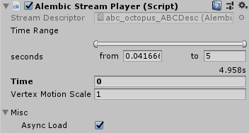
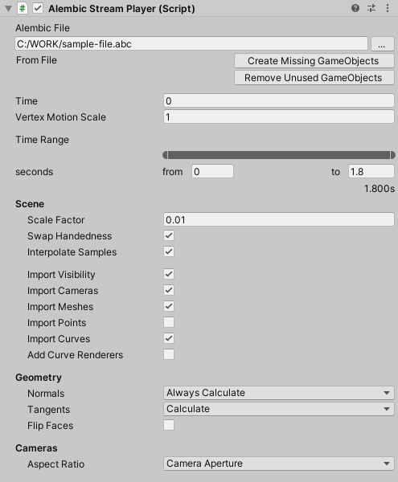
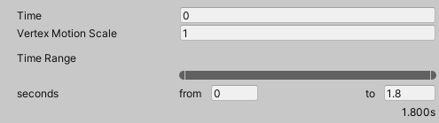

# Alembic Stream Player component

The purpose and properties of the Alembic Stream Player component varies depending on the context in which you are using it:
* On an imported instance of Alembic asset whose source is located [in your project](#alembic-asset-located-in-your-project), it allows you to customize import and playback for this specific instance.
* On a GameObject or Prefab that contains an imported Alembic asset whose source is located [outside your project](#alembic-asset-located-outside-your-project), it allows you to manage all import properties for the imported asset.

## Alembic asset located in your project

When you are using an imported instance of Alembic asset whose source is located in your Unity project, the properties of its Alembic Stream Player component are the following:

[!include]

## Alembic asset located outside your Project

When you are using an imported Alembic asset whose source is located outside your Unity project, the properties of its Alembic Stream Player component are the following:

The properties of the Alembic Stream Player component fall into the following categories:

- [Alembic file options](#alembic-file-options)
- [Playback options](#playback-options)
- [Scene options](#scene-options)
- [Geometry options](#geometry-options)
- [Cameras options](#cameras-options)

### Alembic file options

| Property/Button | Function |
| :--- | :--- |
| **Alembic file** | Allows you to select the Alembic file to import from outside your project.  **Note:** You can only select a file from any local folder or any mapped network drive available through your file system. You cannot target a file through a direct network path or an FTP/HTTP link. |
| **Create Missing GameObjects** | Creates in the current hierarchy of your imported Alembic asset* any GameObject that would be missing according to the actual node hierarchy of the external Alembic file. |
| **Remove Unused GameObjects** | Removes from the current hierarchy of your imported Alembic asset* any GameObject that would not correspond to an actual node in the external Alembic file. |

\* If your imported Alembic asset is part of a Prefab, you should perform these actions directly from the Prefab asset located in your Project window rather than from any Prefab instance of your Scene, in order to avoid any unexpected issues with Prefab overrides.

### Playback options

[!include]

### Scene options

[!include]

### Geometry options

[!include]

### Cameras options

[!include]
