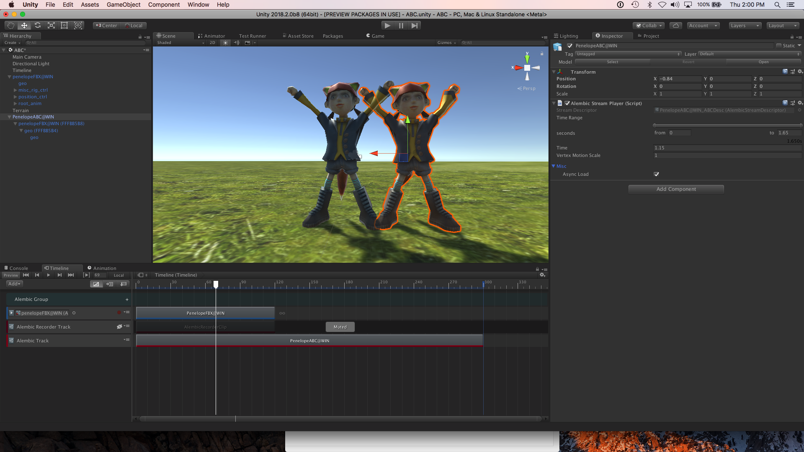

# Recording with the Alembic Recorder clip

You can record the following types of components to Alembic files using the **Alembic Recorder Clip** component:
* Static Meshes ([**MeshRenderer**](https://docs.unity3d.com/Manual/class-MeshRenderer.html) component)
* Skinned Meshes ([**SkinnedMeshRenderer**](https://docs.unity3d.com/Manual/class-SkinnedMeshRenderer.html) component)
* Particles ([**ParticleSystem**](https://docs.unity3d.com/Manual/class-ParticleSystem.html) component)
* Cameras ([**Camera**](https://docs.unity3d.com/Manual/class-Camera.html) component)

To record Timeline animation to an Alembic file:

1. [Add an **Alembic Recorder Track**](https://docs.unity3d.com/Manual/TimelineAddingTracks.html) to the GameObject's Timeline.

2. [Add an **Alembic Recorder Clip**](https://docs.unity3d.com/Manual/TimelineAddingClips.html) to the new Alembic Recorder Track.

3. Open the new Alembic Recorder Clip in the Inspector view.

   

4. To name the Alembic file and choose where to write it to, use the [Alembic Recorder Clip component](ref_Recorder.html)'s **Output Path** property.

5. To change the recording scope from the default (**Entire Scene**), navigate to the **Capture Settings** grouping and choose **Target Branch** in the **Scope** property, then set a reference to the root object in the **Target** property.

6. You can customize a number of [Alembic Recorder Clip properties](ref_Recorder.html), including limiting which components to record.

7. When you are ready to record to file, [click the Game **Play** button](https://docs.unity3d.com/Manual/Toolbar.html) from the main Unity toolbar. The animation plays and Unity logs a message to the Console.

8. Click the Game **Play** button again to finish the recording.

You can import the Alembic file back into the Project and play it back using Timeline with either an [Infinite clip](time_InfiniteClip.html) or an [Alembic Shot](time_AlembicShot.html).

