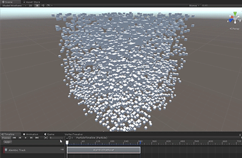

# Play back using an Alembic Shot clip

You can play back Alembic as an **Alembic Shot** on an **Alembic Track**.

To create an Alembic Shot:

1. Drag a GameObject with an [Alembic Stream Player](ref_StreamPlayer.md) component onto the Clips view in Timeline.

   If Timeline is empty, create a temporary track so that you can see the Clips view.

   

2. Select **Add Clip With Alembic Track** from the pop-up menu.

   A new Alembic clip appears in the Clips view.

3. Play back the animation using the [Timeline Play controls](https://docs.unity3d.com/Manual/TimelinePlaybackControls.html) in the Timeline window.

4. If you want to change when the Alembic Shot clip stops playing, you can modify the __End Offset__ property on the [Alembic Shot Asset component](ref_Shot.md).
