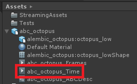
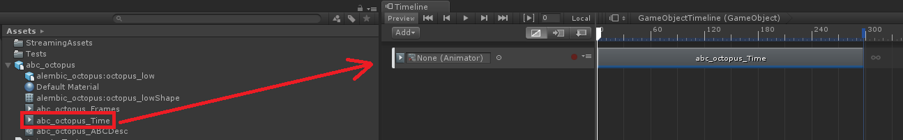

# Playback using an Alembic Animation clip

When Unity imports an Alembic file, it automatically imports the animation as an Animation clip. To access the imported clip, expand the imported Alembic Asset.

The naming convention of the Animation Clip is `<modelName>_Time`.

## Playing the clip in Timeline

To play back the clip in [Timeline](https://docs.unity3d.com/Manual/TimelineSection.html):

1. Import the Alembic file into the Scene.

2. Add an Animator component to the root of the Alembic GameObject hierarchy (the same object which has the [Alembic Stream Player](ref_StreamPlayer.md) component).

3. Drag the Animation clip from the Alembic Asset in the Project view onto the Timeline view.

    

4. Set the Animator driving the Animation clip to the newly created Animator component.

4. Play back the animation using the [Timeline Play controls](https://docs.unity3d.com/Manual/TimelinePlaybackControls.html) in the Timeline view.

You can also use the Animator to play back the clip by adding it to the [Animation Controller](https://docs.unity3d.com/Manual/Animator.html) just like any other clip.
