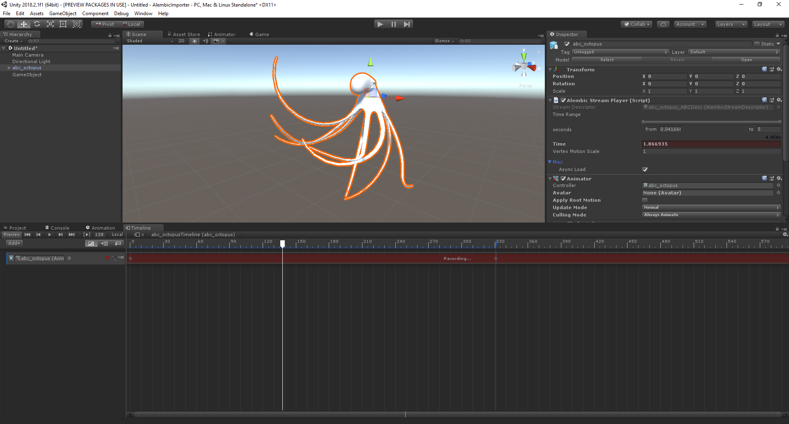

# Record and play back the Alembic using an Infinite clip

To control the playback of Alembic, use an **Infinite clip** on a Timeline **Animation Track** bound to the GameObject that contains the [Alembic Stream Player](ref_StreamPlayer.md) component.

1. Select the GameObject with the Alembic Stream Player component and [open the Timeline window](https://docs.unity3d.com/Manual/TimelineEditorWindow.html).
2. [Create a Director component and a Timeline Asset](https://docs.unity3d.com/Manual/TimelineWorkflowCreatingAssetInstance.html) if you don't already have them.
3. Begin recording, and save keys for the **Time** property on the **Alembic Stream Player** component (see Unity documentation on [Recording basic animations with an Infinite clip](https://docs.unity3d.com/Manual/TimelineWorkflowRecordingBasicAnimation.html)). For example, if the Alembic file lasts 16 seconds, set a key at the beginning of the clip where the **Time** property is set to 0, and another key at the end of the clip where the **Time** property is set to 16.
4. Play back the animation using the [Timeline Play controls](https://docs.unity3d.com/Manual/TimelinePlaybackControls.html) in the Timeline window.

If you want to use the animation in the GameObject's animation state machine, you can [convert the Infinite clip into an animation clip](https://docs.unity3d.com/Manual/TimelineWorkflowConvertingInfiniteClip.html) and add it to the [Animation Controller](https://docs.unity3d.com/Manual/Animator.html).
