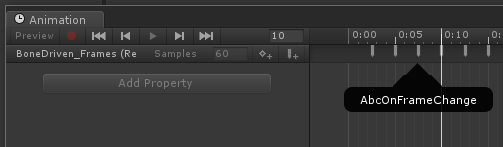

# Using Animation Events with Alembic files

The Alembic package allows you set up an animation event callback for Alembic clips. For example, you could create a callback to change the Textures on an Alembic Mesh at runtime or instantiate Prefabs at a specific frame during playback.

When importing an Alembic file, Unity automatically generates an animation clip that contains animation events for every frame of the clip.



The naming convention of the animation clip is `<modelName>_Frames`.

## Setting up an Animation event

To use this callback, [add a script component](https://docs.unity3d.com/Manual/CreatingAndUsingScripts.html) to your Alembic GameObject with the **AbcOnFrameChange()** method. For example, this method below prints the current frame of the Alembic file to the Unity console:

```
void AbcOnFrameChange (int frame) {
    Debug.Log(frame);
}
```

> ***Note:*** The animation event clip does not contain any animation curves: only the per-frame animation events. As with any other Unity animation clip, you can blend and layer them in any [Animator Controller](https://docs.unity3d.com/Manual/class-AnimatorController.html).

For general information about using animation, see [Using Animation Events](https://docs.unity3d.com/Manual/animeditor-AnimationEvents.html) in the Unity manual.
