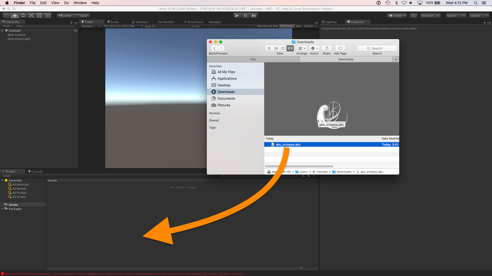
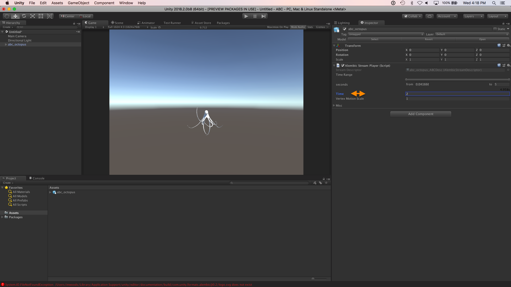
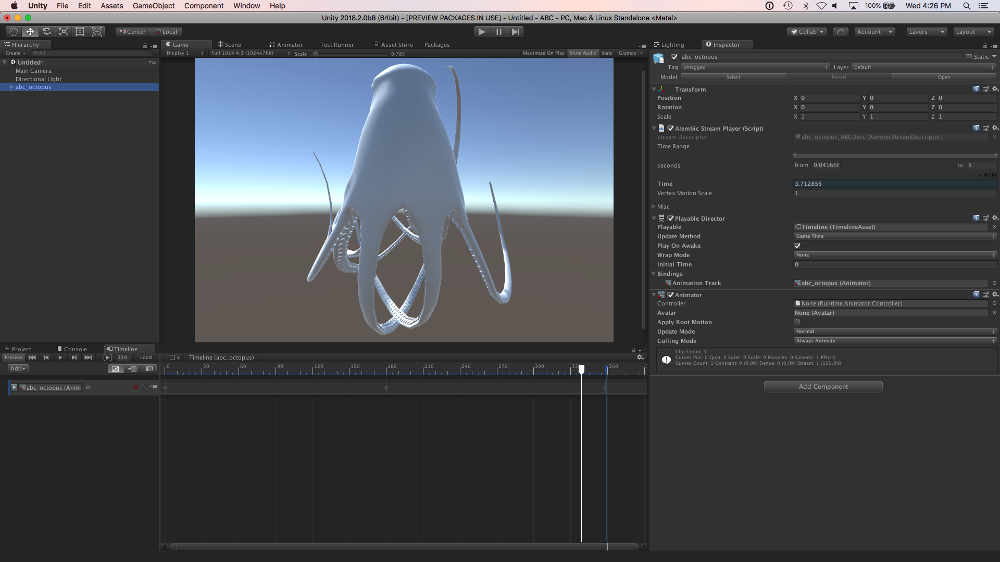

# Tutorial – Import and play back Alembic

This quick tutorial covers adding Alembic assets to your Project and using them in Unity. It demonstrates importing and playing back Alembic content.

1. Drag an Alembic (.abc) file into the Project view. This imports the Alembic Asset into Unity.

   

2. Drag the Alembic Asset into the Scene.

3. Open the **Alembic Stream Player** component in the Inspector and scrub the **Time** property.

   If you are unfamiliar with the term *scrub*, it basically means to move the control left and right. In Unity, you can click-and-drag over the label on a control to move it left and right.

   

   Next, you can learn how to play back the Alembic animation using the [Timeline Editor](https://docs.unity3d.com/Manual/TimelineEditorWindow.html).

4. Select your Alembic object in the Scene view and open the Timeline Editor (top menu: **Window** > **Sequencing** > **Timeline**).

5. Click the **Create** button to [create a Director component and a Timeline Asset](https://docs.unity3d.com/Manual/TimelineWorkflowCreatingAssetInstance.html) and save it to file.

   Unity displays the Timeline Editor with a default Animation Track.

   

6. Remove the Animation Track (select **Delete** from the context menu or the Track menu).

7. Drag the Alembic object from the Scene onto the Timeline Editor and select **Add Clip With Alembic Track** from the pop-up menu.

   This creates an Alembic Track with an Alembic clip.

8. Now you can [scrub the Timeline Playhead or use the Timeline Playback Controls](https://docs.unity3d.com/Manual/TimelinePlaybackControls.html) to see the animation playing in Unity.
