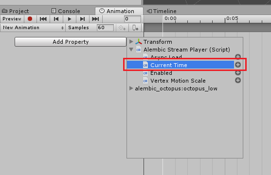
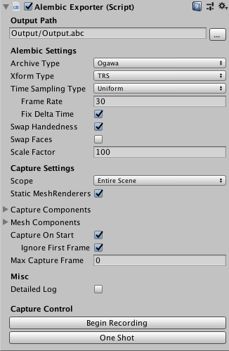
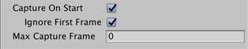
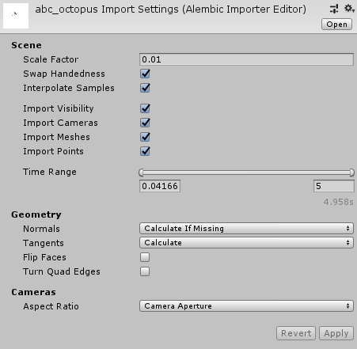
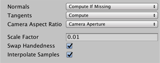
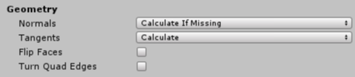
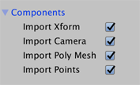

# About the Alembic package

Use the Alembic package to import and export [Alembic](http://www.alembic.io/) files into your Unity Scenes where you can playback and record animation directly in Unity. The Alembic format bakes animation data into a file so that you can stream the animation in Unity directly from the file. This saves a tremendous amount of resources, as the modeling and animating does not happen directly inside Unity.

The Alembic package brings in vertex cache data from a 3D modeling software, such as facial animation (skinning) and cloth simulation (dynamics). When you play it back inside Unity, it looks exactly the same as it did in the 3D modeling software. 

## Overview

The Alembic package supports these features:

- [Importing](#import) data from Meshes, Particle Cloud Points, and Cameras.
- Applying [Alembic Shaders](#shaders) and [Motion Blur](#blur) effects.
- Customizing [particle and point cloud effects](#particles).
- Playing animation by streaming data through [Timeline](#timeline) or [Unity Animation](#animClip).
- [Recording animation](#TimelineAlembicRecorder) in Timeline.
- [Exporting](#export) Unity GameObjects to an Alembic file.

## Requirements

The Alembic Package is compatible with Unity Editor 2018.1 and above.

The package is available on these 64-bit desktop platforms:
* Microsoft® Windows® 10
* macOS® Sierra (10.12)
* GNU/Linux (CentOS 7, Ubuntu 16.x and Ubuntu 17.x)

## Known limitations

* Material import and export are not supported, as they are not supported in Alembic.
* There is no exposed public API in the Alembic package.

## Feedback

We welcome hearing about your experience on [the Alembic-For-Unity forum](https://forum.unity.com/threads/alembic-for-unity.521649/).

## Installing the Alembic package

To install this package, follow the instructions in the [Package Manager documentation](https://docs.unity3d.com/Packages/com.unity.package-manager-ui@latest).

Verify that the Alembic package is correctly installed by trying to add an Alembic component to a GameObject or Camera:

1. Select a GameObject or Camera and open the Inspector view.

2. Click the **Add Component** button and search for **alem**.

   If it installed properly, you can see some Alembic components in the list:

   


# Importing Alembic files

<a name="import"></a>

You can import Alembic files like [any other Asset](https://docs.unity3d.com/Manual/ImportingAssets.html): 

1. Drag your .abc file into your Project view. 
2. Select the file in the Project view and open the Inspector view. 
3. Customize how you want Unity to import the file by adjusting the [options on the Alembic Import Settings window](#importRef).
4. Drag your file from your Project into your Scene.

Once imported, you may also want to [reassign the Default Material](#materials) to a custom Material, since the Alembic format does not support any Material data. 

In addition, the Alembic package provides a number of [Shaders](#shaders) that are customized for Alembic data. 


<a name="dccs"></a>

# Creating Alembic files in Autodesk® Maya®

You can import Autodesk® Maya®'s shading group as a sub-Mesh. Before exporting to an Alembic file, enable the **Write Face Sets** option in Autodesk® Maya®, which is disabled by default.

The Alembic package also supports Autodesk® Maya®'s vertex color and multiple UV sets. Before exporting to an Alembic file, enable the **Write Color Sets** and **Write UV Sets** options in Autodesk® Maya®, both of which are disabled by default.

|


# Controlling Alembic playback

You can customize importing and playing back Alembic data through the properties on the [Alembic Stream Player component](#streamRef). 

If you change the **Time** parameter you can see the Alembic objects moving. To play the animation this parameter can be controlled from the [Timeline](#timeline) window, [Animation](#animClip) window, or via scripts.

**Vertex Motion Scale** is a magnification factor when calculating velocity. The greater the velocity and motion scale, the more blurring the [Motion Blur post processing effect](#blur) applies.


<a name="timeline"></a>

# Using Alembic with Timeline

You can use Timeline to play back and record Alembic animation including:

* Playing Alembic animation by [controlling the Alembic Stream Player component](#TimelineInfiniteClip) through an Infinite clip. This takes a little longer to set up than using an Alembic clip, but you can easily convert an Infinite clip to an Animation clip to use in an Animator controller (state machine). 
* Creating sequences [using Alembic clips](#TimelineAlembicShot), including trimming times and adjusting clip-ins. 
* Recording Alembic data directly [from the Timeline to an Alembic file](#TimelineAlembicRecorder).


<a name="TimelineInfiniteClip"></a>

## Record and play back the Alembic using an Infinite clip

You can control the playback of Alembic using an **Infinite clip** on a Timeline **Animation Track** bound to the GameObject with the [Alembic Stream Player](#streamRef) component. 

1. Select the GameObject with the Alembic Stream Player component and [open the Timeline window](https://docs.unity3d.com/Manual/TimelineEditorWindow.html).
2. [Create a Director component and a Timeline Asset](https://docs.unity3d.com/Manual/TimelineWorkflowCreatingAssetInstance.html) if you don't already have them. 
3. [Begin recording and save keys](https://docs.unity3d.com/Manual/TimelineWorkflowRecordingBasicAnimation.html) for the [**Time** property on the **Alembic Stream Player** component](#streamRef). For example, if the Alembic file lasts 16 seconds, set a key at the beginning of the clip where the **Time** property is set to 0, and another key at the end of the clip where the **Time** property is set to 16.
4. Play back the animation using the [Timeline Play controls](https://docs.unity3d.com/Manual/TimelinePlaybackControls.html) in the Timeline window. 


If you want to use the animation in the GameObject's animation state machine, you can [convert the Infinite clip into an animation clip](https://docs.unity3d.com/Manual/TimelineWorkflowConvertingInfiniteClip.html) and add it to the [Animation Controller](https://docs.unity3d.com/Manual/Animator.html).


<a name="TimelineAlembicShot"></a>

## Play back using an Alembic Shot clip

You can play back Alembic as an **Alembic Shot** on an **Alembic Track**. 


To create an Alembic Shot: 

1. Drag a GameObject with an [Alembic Stream Player](#streamRef) component onto the Clips view in Timeline. 

   If Timeline is empty, create a temporary track so that you can see the Clips view.

   

2. Select **Add Clip With Alembic Track** from the pop-up menu.

   A new Alembic clip appears in the Clips view.

3. Play back the animation using the [Timeline Play controls](https://docs.unity3d.com/Manual/TimelinePlaybackControls.html) in the Timeline window. 


<a name="TimelineAlembicRecorder"></a>

## Recording with the Alembic Recorder clip

You can record the following types of components to Alembic files using the **Alembic Recorder Clip** component:
* Static Meshes (**MeshRenderer** component)
* Skinned Meshes (**SkinnedMeshRenderer** component)
* Particles (**ParticleSystem** component)
* Cameras (**Camera** component)


To record Timeline animation to an Alembic file:

1. [Add an **Alembic Recorder Track**](https://docs.unity3d.com/Manual/TimelineAddingTracks.html) to the GameObject's Timeline.

2. [Add an **Alembic Recorder Clip**](https://docs.unity3d.com/Manual/TimelineAddingClips.html) to the new Alembic Recorder Track.

3. Open the new Alembic Recorder Clip in the Inspector view.

   

4. You can name the Alembic file and choose where to write it to in the **Output Path** property on the [Alembic Recorder Clip component](#recordRef).

5. If you want to change the recording scope from the default (**Entire Scene**), choose **Target Branch** in the **Scope** property under the **Capture Settings** grouping and then set a reference to the root object in the **Target** property.

6. You can customize a number of [Alembic Recorder Clip properties](#recordRef), including limiting which components to record.

7. When you are ready to record to file, [click the Game **Play** button](https://docs.unity3d.com/Manual/Toolbar.html) from the main Unity toolbar. The animation plays and Unity logs a message to the Console.

8. Click the Game **Play** button again to finish the recording.

You can import the Alembic file back into the Project and play it back using Timeline with either an [Infinite clip](#TimelineInfiniteClip) or an [Alembic Shot](#TimelineAlembicShot).


<a name="animClip"></a>

# Using Alembic with Unity Animation

You can control the playback of Alembic using Unity's Animation System bound to the GameObject with the [Alembic Stream Player](#streamRef) component. 

1. Select the GameObject with the Alembic Stream Player component and [open the Animation window](https://docs.unity3d.com/Manual/animeditor-UsingAnimationEditor.html).
2. [Create an Animator component and an Animation clip](https://docs.unity3d.com/Manual/animeditor-CreatingANewAnimationClip.html) if you don't already have them. 
3. [Save keyframes](https://docs.unity3d.com/Manual/animeditor-AnimatingAGameObject.html) for the [**Time** property on the **Alembic Stream Player** component](#streamRef). 

   
4. For example, if the Alembic file lasts 16 seconds, set a key at the beginning of the clip where the **Time** property is set to 0, and another key at the end of the clip where the **Time** property is set to 16.
5. Play back the animation using the [Animation view Play controls](https://docs.unity3d.com/Manual/animeditor-UsingAnimationEditor.html) in the Animation window or [click the Game **Play** button](https://docs.unity3d.com/Manual/Toolbar.html) from the main Unity toolbar. 

Now you have a Unity Animation clip containing the animation from the Alembic file.

If you want to use the clip in the GameObject's animation state machine, you can add it to the [Animation Controller](https://docs.unity3d.com/Manual/Animator.html) just like any other Animation clip.


<a name="export"></a>

# Exporting Unity GameObjects to Alembic files

The Alembic exporter supports exporting single frame and multi-frame Alembic files and can export GameObjects with the following components:

- Static Meshes (**MeshRenderer** component)
- Skinned Meshes (**SkinnedMeshRenderer** component)
- Particles (**ParticleSystem** component)
- Cameras (**Camera** component)

To configure a scene to export an Alembic file, add the [Alembic Exporter component](#exportRef) to a GameObject in the scene. You can add it to an empty object in the scene; it is not necessary to add it to the objects being exported. 

You can configure the component to export the entire scene or individual object hierarchies.

> ***Warning:*** Using the AlembicExporter component automatically disables Draw Call Batching. Because of this, you may notice your Scene slowing down, since the elements are no longer static. 

If the Mesh group is valid after being batched then the Alembic package exports it. In some cases the data is batched multiple times and the results may change.  

If you want to control the Batch settings, open the Rendering section of Player settings (from Unity's main menu: **Edit** > **Project Settings** > **Player** > **Other Settings** > **Rendering**).


<a name="particles"></a>

# Working with Particles

When you import an Alembic file that contains particles, the Alembic package automatically adds two custom components to help you work with particles: 

* The [Alembic Point Cloud component](#ptCloudRef) helps you define the shape and volume of the particle's point cloud. You can set the extents of the bounding box (AABB) and particle sorting options for the cloud.
* The [Alembic Point Renderer component](#ptRendRef) helps you customize the appearance of the points. You can define shadows, trails, shapes, and Materials for the points in the cloud.


# Working with Materials

This section contains information about [how to handle Materials](#materials) when importing and how to set up [Motion Blur](#blur). It also lists the [set of Shaders provided](#shaders) with the package that are specifically customized to work with Alembic.


<a name="materials"></a>

## Assigning Materials on Import

By default Unity assigns the **Default Material** to imported Alembic Meshes. You need to manually reassign your Materials for each object.

The Alembic package does not support remapping Face Set names to Materials or creating Materials from Face Set names.


<a name="shaders"></a>

## Alembic Shaders

The Alembic package includes the following Shaders:

| *Shader:*              | *Description:* |
|:------------------------------|:----------|
|__Overlay__                    |Alembic visualization Shader. Use it to visualize the normals, tangents, UV spaces and vertex colors of your Mesh. |
|__Points Standard__            |When importing Alembic Point Caches (or using the ones generated when you record a Unity particle system), you can assign a Mesh of your choosing to each Point to achieve effects such as a flock of birds or falling rubble. <br/>For optimization purposes, when Unity imports Alembic Points, it applies this Shader, which is a dedicated, simplified version of the **Standard** Shader.|
|__Points Transparent__         |With this Shader, you can use transparency on Meshes acting as Alembic Points and customize both their blending mode and how they interact with the Depth Buffer.|
|__Points Motion Vectors__      |For proper conveyance of motion vectors with Point Caches, Alembic Points components need a dedicated Shader. Unity creates and assigns these Shaders and their associated Materials automatically.|
|__Standard__                   |Standard Physically Based Renderer (PBR) Material with Motion Blur support added. |
|__Standard (Roughness setup)__ |Standard PBR Roughness Material with Motion Blur support added. |
|__Standard (Specular setup)__   |Standard Specular Material with Motion Blur support added. |


<a name="blur"></a>

## Motion Blur

Although Unity generates motion vectors for Mesh and Skinned Mesh Renderers, the Alembic Shaders add motion vector support to Alembic files only. This is useful for rendering that requires motion vectors, such as the Motion Blur post processing effect. 

|

In the above image, on the left the character is unprocessed. On the right you can see the output of motion vector and Motion Blur applied by the post processing stack.

If you want to add the motion vector generation function to your own Shader, add this line inside a SubShader: 

```c++
UsePass "Hidden / Alembic / MotionVectors / MOTIONVECTORS" 
```

Since the velocity data is passed to the fourth UV, Unity uses this data to calculate the apex position of the previous frame. See **AlembicMotionVectors.cginc** for the **MotionVectorData** struct. 


# Window reference

This section provides details on the properties for the following windows or components:

- [Alembic Exporter component](#exportRef), which allows you to export GameObjects, Cameras, and Points (in the Particle System).
- [Alembic Point Cloud component](#ptCloudRef), which allows you to customize the shape and behavior of the point cloud.
- [Alembic Point Renderer component](#ptRendRef), which allows you to customize the appearance of the particles in the point cloud.
- [Alembic Recorder Clip component](#recordRef), which allows you to record animation from the Alembic file.
- [Alembic Stream Player component](#streamRef), which allows you to play back animation from the Alembic file in either Timeline or Unity Animation.
- [Import Settings for Alembic](#importRef), which allows you to customize importing the data from the Alembic file.


<a name="exportRef"></a>

## Alembic Exporter component

You can use the Alembic Exporter component to customize how the Alembic package exports animation to an Alembic file. 



The following topics describe the properties of the Alembic Exporter component in detail:

- [**Output Path** section](#exportRef_A)
- [**Alembic Settings** section](#exportRef_B)
- [**Capture Settings** section](#exportRef_C)
- [**Capture Components** option group](#exportRef_D)
- [**Mesh Components** option group](#exportRef_E)
- [More Capture options](#exportRef_F)
- [**Misc** section](#exportRef_G)
- [**Capture Control** section](#exportRef_H)

> ***Note:*** The Alembic package appends an ID (for example, `(0000283C)`) to the name of the Alembic node on export. This is to avoid naming conflicts, because Alembic forces each node in a hierarchy to have a unique name. 


<a name="exportRef_A"></a>

### Output Path section

Specify the location to save the Alembic file to. By default, the output path is relative to the current Unity Project path.


<a name="exportRef_B"></a>

### Alembic Settings section

Use these settings to define the properties of the Alembic output.


| ***Property***      |             | ***Description***                                            |
| :------------------ | :---------- | :----------------------------------------------------------- |
| __Archive Type__    |             | Choose the Alembic format specification.                     |
|                     | __HDF5__    | This is a common hierarchical data format for Alembic.       |
|                     | __Ogawa__   | This format produces smaller files and better performance than HDF5. This is the default format. |
| __Xform Type__      |             | Choose the transform type.                                   |
|                     | __Matrix__  | Record the full transformation matrix.                       |
|                     | __TRS__     | Record the TRS channels for position, rotation, scale of an object. This is the default transform type. |
| *__Time Sampling__* |             |                                                              |
| __Type__            |             | Choose the time sampling mode.                               |
|                     | __Uniform__ | The interval between frames on the Alembic side is always constant (`1 / Frame Rate seconds`). |
|                     | __Acyclic__ | The delta time in Unity is the interval between the frames on the Alembic side. The interval is not constant, but the impact on the game progress is minimal. It is a mode mainly assuming 3D recording of games. |
| __Frame Rate__      |             | Set the frame rate to use for uniform sampling. This option is only available when Time Sampling **Type** is set to Uniform. |
| __Fix Delta Time__  |             | Enable this option to set [Time.maximumDeltaTime](https://docs.unity3d.com/ScriptReference/Time-maximumDeltaTime.html) using the frame rate to ensure fixed delta time. In the case of video production this is the desired behavior.<br/>***Note:*** If you are managing [Time.maximumDeltaTime](https://docs.unity3d.com/ScriptReference/Time-maximumDeltaTime.html) yourself, be aware that this could lead to non-uniform delta time. <br/>This option is only available when Time Sampling **Type** is set to Uniform. |
| __Swap Handedness__ |             | Enable to change from a left hand coordinate system (Unity) to a right hand coordinate system (Autodesk® Maya®). |
| __Swap Faces__      |             | Enable to reverse the front and back of all faces.           |
| __Scale Factor__    |             | Set scale factor to convert between different system units. For example, using 0.1 will convert the Unity units to 1/10 of their value in the resulting Alembic file. This also affects position and speed. |


<a name="exportRef_C"></a>

### Capture Settings section

Use these settings to determine the set of target GameObject(s) for the current capture. Once the capture begins, the target set is locked and does not change. Enabling or disabling a GameObject in the target set does not affect the capture. Any GameObjects generated after the start of the capture are not included.

> ***Warning:*** Deleting a target GameObject in the middle of a capture interrupts the capture, and the Alembic file may have a non-uniform number of samples as a result. Some software may not handle this properly.


| ***Property***                             |                   | ***Description***                                            |
| :----------------------------------------- | :---------------- | :----------------------------------------------------------- |
| __Scope__                                  |                   | Choose the scope of the export. By default, this is set to the **Entire Scene**. |
|                                            | __Entire Scene__  | Export the entire Scene. This is the default.                |
|                                            | __Target Branch__ | Export only a branch (or hierarchy) of the Scene. When you choose this option, the **Target** property appears, which allows you to select a GameObject. |
| __Target__                                 |                   | Set a reference to the GameObject that is the root of the hierarchy you want to export.<br/>This property is only available if the **Scope** property is set to __Target Branch__. |
| __Assume Non Skinned Meshes Are Constant__ |                   | Enable this option to skip capturing animation on static Meshes. |


<a name="exportRef_D"></a>

### Capture Components option group

Use these settings to define which components to save data for.


| ***Property***          | ***Description***                                            |
| :---------------------- | :----------------------------------------------------------- |
| __MeshRenderer__        | Enable to export [MeshRenderer](https://docs.unity3d.com/Manual/class-MeshRenderer.html) components. |
| __SkinnedMeshRenderer__ | Enable to export [SkinnedMeshRenderer](https://docs.unity3d.com/Manual/class-SkinnedMeshRenderer.html) components. |
| __ParticleSystem__      | Enable to export [ParticleSystem](https://docs.unity3d.com/Manual/class-ParticleSystem.html) components. |
| __Camera__              | Enable to export [Camera](https://docs.unity3d.com/Manual/class-Camera.html) components. |


<a name="exportRef_E"></a>

### Mesh Components option group

Use these settings to fine-tune the Mesh data you are saving.


| ***Property***   | ***Description***               |
| :--------------- | :------------------------------ |
| __Normals__      | Enable to export Mesh normals.  |
| __UV1__          | Enable to export Mesh UV1.      |
| __UV2__          | Enable to export Mesh UV2.      |
| __Vertex Color__ | Enable to export vertex colors. |
| __Submeshes__    | Enable to export sub-Meshes.    |

> ***Note:*** Material export is not supported, as it is not supported in Alembic.


<a name="exportRef_F"></a>

### More Capture options

These options allow you to control starting and stopping the capture.



| ***Property***         | ***Description***                                            |
| :--------------------- | :----------------------------------------------------------- |
| __Capture On Start__   | Enable to begin capturing in Start() when a Scene with an [AlembicExporter](#exportRef) component is loaded. |
| __Ignore First Frame__ | Enable to skip capturing the first frame. <br/>Only available if **Capture On Start** is enabled. |
| __Max Capture Frame__  | Set the frame to stop capturing at.                          |


<a name="exportRef_G"></a>

### Misc section

Enable the __Detailed Log__ option to provide Debug logging for each captured frame. 


<a name="exportRef_H"></a>

### Capture Control section

The buttons in this section allow define how much of the animation to capture.


In play mode, click __Begin Recording__ to start capturing the entire scene. Use this option if **Capture On Start** is disabled.

You can click __One Shot__ to export only the current frame to the Alembic file.


<a name="ptCloudRef"></a>

## Alembic Point Cloud component

The **Alembic Point Cloud** component allows you to define the shape and volume of the particle's point cloud.


| ***Property*** | ***Description*** |
|:---|:---|
| **Bounds Center** | Set the position in **X**, **Y**, and **Z** for the center of the particle cloud. |
| **Bounds Extents** | Set the bounding limit for the particle cloud. Each **X**, **Y**, and **Z** value defines the maximum distance between the **Bounds Center** value and the extents of the bounding box (AABB). For more information, see the [Bounds struct reference page in the Unity manual](https://docs.unity3d.com/ScriptReference/Bounds.html). |
| **Sort** | Check to enable particle sorting. Particle sorting allows you to set realistic particle effects by defining the order in which Unity renders particles. For example, the particles that are drawn last overlay the particles that were drawn earlier. |
| **Sort From** | Set the point of reference for sorting particles. For example, if you select a camera, Unity renders the particles furthest away from that camera first, so that the closest particles to the camera overlay the others. |


<a name="ptRendRef"></a>

## Alembic Point Renderer component

The **Alembic Point Renderer** component allows you to customize the appearance of the points.


| ***Property*** || ***Description*** |
|:---|:---|:---|
| **Mesh** || Set a reference to the Mesh that you want to use as the shape for each particle. Defaults to the Cube shape. |
| ***Materials*** |||
| **Size** || Set the number of different Materials to use for points. For example, to use a fire Material for some of the particles and a smoke Material for the rest, enter **2**. <br/>A corresponding number of **Element** properties appear below this option. <br/>Defaults to 0. |
| **Element <number>** || Set a reference to the Material you want to use for rendering the points in the particle cloud.<br/>Only available if the **Size** option is set to a number greater than 0. |
| **Motion Vector Material** || Set the Material used for motion vectors (trails) if the **Generate Motion Vector** option is enabled. |
| **Cast Shadows** || Define whether points should cast shadows and if so, how. |
|| **On** | Choose this option to cast a shadow. |
|| **Off** | Don't cast a shadow. |
|| **Two Sided** | Cast a shadow on two sides. |
|| **Shadows Only** | Render the shadow but don't render the point itself. |
| **Apply Transform** || Enable to apply previous transform of particles to MaterialPropertyBlock vector at end of each update. Otherwise, reset the transform. |
| **Receive Shadows** || Enable to have points receive shadows. |
| **Generate Motion Vector** || Enable to generate motion vectors for points. |
| **Point Size** || Set the size of points in meters. |


<a name-"recordRef"></a>

## Alembic Recorder Clip component

The Alembic Recorder Clip component allows you to capture animation from GameObjects in Timeline and save it out to an Alembic file.


The following topics explain the properties of the Alembic Recorder Clip component in detail:

- [**Output Path** section](#recordRef_A)
- [**Alembic Settings** section](#recordRef_B)
- [**Capture Settings** section](#recordRef_C)
- [**Capture Components** option group](#recordRef_D)
- [**Mesh Components** option group](#recordRef_E)
- [**Ignore First Frame** option](#recordRef_F)
- [**Misc** section](#recordRef_H)


<a name="recordRef_A"></a>

### Output Path section

Specify the location to save the Alembic file to. By default, the output path is relative to the current Unity Project path.


<a name="recordRef_B"></a>

### Alembic Settings section

Use these settings to define the properties of the Alembic output.


| ***Property***      |            | ***Description***                                            |
| :------------------ | :--------- | :----------------------------------------------------------- |
| __Archive Type__    |            | Choose the Alembic format specification.                     |
|                     | __HDF5__   | This is a common hierarchical data format for Alembic.       |
|                     | __Ogawa__  | This format produces smaller files and better performance than HDF5. This is the default format. |
| __Xform Type__      |            | Choose the transform type.                                   |
|                     | __Matrix__ | Record the full transformation matrix.                       |
|                     | __TRS__    | Record the TRS channels for position, rotation, scale of an object. This is the default transform type. |
| __Swap Handedness__ |            | Enable to change from a left hand coordinate system (Unity) to a right hand coordinate system (Autodesk® Maya®). |
| __Swap Faces__      |            | Enable to reverse the front and back of all faces.           |
| __Scale Factor__    |            | Set scale factor to convert between different system units. For example, using 0.1 will convert the Unity units to 1/10 of their value in the resulting Alembic file. This also affects position and speed. |


<a name="recordRef_C"></a>

### Capture Settings section

Use these settings to determine the set of target GameObject(s) for the current capture. 


| ***Property***                             |                   | ***Description***                                            |
| :----------------------------------------- | :---------------- | :----------------------------------------------------------- |
| __Scope__                                  |                   | Choose the scope of the export. By default, this is set to the **Entire Scene**. |
|                                            | __Entire Scene__  | Export the entire Scene. This is the default.                |
|                                            | __Target Branch__ | Export only a branch (or hierarchy) of the Scene. When you choose this option, the Capture Settings **Target** property appears, which allows you to select a GameObject. |
| __Target__                                 |                   | Set a reference to the GameObject that is the root of the hierarchy you want to export.<br/>This property is only available if the **Scope** property is set to __Target Branch__. |
| __Assume Non Skinned Meshes Are Constant__ |                   | Enable this option to skip capturing animation on static Meshes. |


<a name="recordRef_D"></a>

### Capture Components option group

Use these settings to define which components to save data for.


| ***Property***          | ***Description***                                            |
| :---------------------- | :----------------------------------------------------------- |
| __MeshRenderer__        | Enable to record [MeshRenderer](https://docs.unity3d.com/Manual/class-MeshRenderer.html) components. |
| __SkinnedMeshRenderer__ | Enable to record [SkinnedMeshRenderer](https://docs.unity3d.com/Manual/class-SkinnedMeshRenderer.html) components. |
| __ParticleSystem__      | Enable to record [ParticleSystem](https://docs.unity3d.com/Manual/class-ParticleSystem.html) components. |
| __Camera__              | Enable to record [Camera](https://docs.unity3d.com/Manual/class-Camera.html) components. |


<a name="recordRef_E"></a>

### Mesh Components option group

Use these settings to fine-tune the Mesh data you are saving.


> ***Note:*** Material export is not supported, as it is not supported in Alembic.


| ***Property***   | ***Description***               |
| :--------------- | :------------------------------ |
| __Normals__      | Enable to record mesh normals.  |
| __UV1__          | Enable to record mesh UV1.      |
| __UV2__          | Enable to record mesh UV2.      |
| __Vertex Color__ | Enable to record vertex colors. |
| __Submeshes__    | Enable to record sub-Meshes.    |


<a name="recordRef_F"></a>

### Ignore First Frame option

Enable the **Ignore First Frame** option to skip capturing the first frame. 


<a name="recordRef_G"></a>

### Misc section

Enable the __Detailed Log__ option to provide Debug logging for each captured frame. 


<a name="streamRef"></a>

## Alembic Stream Player component

You can customize import and playback through the properties on this component:


| *Property:*                | *Function:*                                                  |
| :------------------------- | :----------------------------------------------------------- |
| __Time Range__             | Select the range of the imported animation in seconds to be able to play back the animation. By default, this includes the entire animation. |
| __Time__                   | Set the time in seconds of the animation that is currently displayed on the screen. This property operates like a playhead control, as you can scrub or animate it to play the animation. Valid values is from 0 to the length of the animation. |
| __Vertex Motion Scale__    | Set the magnification factor when calculating velocity. Greater velocity means more blurring when used with Motion Blur. By default, the value is set to 1 (the velocity is not scaled). |
| __Ignore Visibility__      | Enable this option to ignore (during playback) any animated visibility that may have been imported from the Alembic file. |
| __Async Load__             | Enable this option to load the file asynchronously during playback. |
| __Recreate Missing Nodes__ | Click to recreate nodes from the Alembic file that have been deleted from the Unity hierarchy. |

> ***Note:*** Please note that copies of .abc files are created under `Assets / StreamingAssets`. This is necessary for streaming data since it requires that the .abc file remain after building the project.


<a name="importRef"></a>

## Alembic Import Settings window

The **Alembic Import Settings (Alembic Importer Editor)** allows you to customize how the Alembic package imports your Alembic file into Unity, including specifying whether or not to include specific components.



The following topics explain the properties of the Alembic Recorder Clip component in detail:

- [Mesh Components options](#importRef_A)
- [Mesh Options option group](#importRef_B)
- [Components option group](#importRef_C)
- [Time range options](#importRef_D)

When you are finished customizing the import options, click **Apply** to proceed or **Revert** to abandon your changes.


<a name="importRef_A"></a>

### Mesh Components options

Use these options to customize how the Alembic Importer treats the Mesh components, such as normals and tangents.




| ***Property*** || ***Description*** |
|:---|:---|:---|
| __Normals__ || Define whether to use the normals from the Alembic file or if they are calculated based on vertex position. |
|| **Read From File** | Get the normals values from a file. |
|| **Compute If Missing** | Use Alembic file normals if they exist; otherwise the Alembic Importer calculates them. This is the default. |
|| **Always Compute** | Calculate the normals on import. |
|| **Ignore** | Do not consider normal values. |
| __Tangents__ || Determine whether or not tangents are computed on import or not added at all. Tangents are not stored in Alembic, so if you choose not to calculate tangents on import, there will be no tangent data. |
|| **None** | Do not calculate or add tangents at all. Choose this option if you don't need to compute the tangents. Computing tangents is expensive, so choosing this option increases the speed of playback. |
|| **Compute** | Calculate tangents on import. This is the default option for this property.<br/>***Note:*** The calculation of tangents requires normals and UV data. If these are missing, the tangent cannot be computed. |
| __Camera Aspect Ratio__ || Define how to set the Unity Camera's aspect ratio. |
|| **Current Resolution** | Determine the aspect ratio from the current resolution which is defined by the screen. |
|| **Default Resolution** | Determine the aspect ratio from the default resolution defined in the Project Settings window for the Player (under **Edit** > **Project Settings** > **Resolution and Presentation** > **Resolution**). |
|| **Camera Aperture** | Determine the aspect ratio from the Camera in the Alembic file. This is the default. |
| __Scale Factor__ || Set the scale factor to convert between different system units. For example, using 0.1 will convert the Alembic units to 1/10 of their value in the resulting Unity GameObject. This also affects position and speed. |
| __Swap Handedness__ || Enable to invert the X axis' direction. |
| __Interpolate Samples__ || Enable to interpolate animation for Transform, Camera, and Mesh components for which the topology does not change (that is, for which the number of vertices and indices are immutable).<br/>If **Interpolate Samples** is enabled, or velocity data is included in the .abc file, you can pass velocity data to an Alembic shader. |


<a name="importRef_B"></a>

### Mesh Options option group

Use these options to customize how Meshes are imported.




| ***Property*** | ***Description*** |
|:---|:---|
| __Swap Face Winding__ | Enable to invert the orientation of the polygons. |
| __Turn Quad Edges__ | Enable to invert the arrangement of the triangles when the quadrilateral polygon is divided into triangles. |
| __Import Point Polygon__ | Do not use <!--<br/>@TODO Remove this row from the table when the screen shots are updated.--> |
| __Import Line Polygon__ | Do not use <!--<br/>@TODO Remove this row from the table when the screen shots are updated.--> |
| __Import Triangle Polygon__ | Do not use <!--<br/>@TODO Remove this row from the table when the screen shots are updated.--> |


<a name="importRef_C"></a>

### Components option group

Use these options to customize which components to import from the Alembic file.




| ***Property*** | ***Description*** |
|:---|:---|
| __Import Xform__ | Enable to import Transform data. |
| __Import Camera__ | Enable to import Camera data. |
| __Import Poly Mesh__ | Enable to import Mesh data. |
| __Import Points__ | Enable to import Point (particle cloud) data. |

> ***Note:*** Since Materials are not supported in Alembic, the Alembic package does not import or export Materials.


<a name="importRef_D"></a>

### Time range options


Enter the start and end frames to define the range of the Alembic animation. 


# Tutorial: Import and play back Alembic

This quick tutorial covers adding Alembic assets to your Project and using them in Unity. It demonstrates importing and playing back Alembic content.

1. Drag an Alembic (.abc) file into the Project view. This imports the Alembic Asset into Unity.

   

2. Drag the Alembic Asset into the Scene. 

3. Open the **Alembic Stream Player** component in the Inspector and scrub the **Time** property.

   If you are unfamiliar with the term *scrub*, it basically means to move the control left and right. In Unity, you can click-and-drag over the label on a control to move it left and right.

   

   Next, you can learn how to play back the Alembic animation using the [Timeline Editor](https://docs.unity3d.com/Manual/TimelineEditorWindow.html).

4. Select your Alembic object in the Scene view and open the Timeline Editor (top menu: **Window** > **Sequencing** > **Timeline**). 

5. Click the **Create** button to [create a Director component and a Timeline Asset](https://docs.unity3d.com/Manual/TimelineWorkflowCreatingAssetInstance.html) and save it to file.

   Unity displays the Timeline Editor with a default Animation Track.

   

6. Remove the Animation Track (select **Delete** from the context menu or the Track menu).

7. Drag the Alembic object from the Scene onto the Timeline Editor and select **Add Clip With Alembic Track** from the pop-up menu.

   This creates an Alembic Track with an Alembic clip. 

8. Now you can [scrub the Timeline Playhead or use the Timeline Playback Controls](https://docs.unity3d.com/Manual/TimelinePlaybackControls.html) to see the animation playing in Unity.


