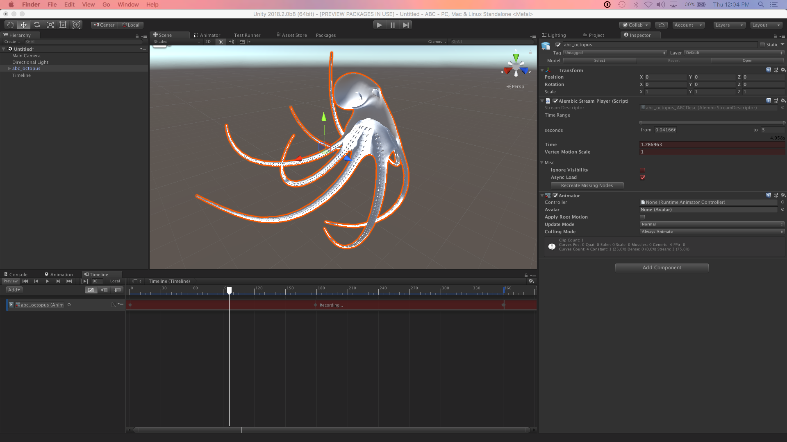
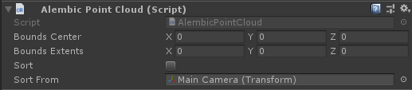

# About the Alembic package

Use the Alembic package to import [Alembic](http://www.alembic.io/) files into your Unity Scenes. The Alembic format bakes animation data into a file so that you can stream the animation in Unity directly from the file. This saves a tremendous amount of resources, as the modeling and animating does not happen directly inside Unity.

The Alembic package brings in vertex cache data from a 3D modeling software, such as facial animation (skinning) and cloth simulation (dynamics). When you play it back inside Unity, it looks exactly the same as it did in the 3D modeling software. 

The Alembic package supports importing and playing back Meshes, Points and Cameras.

@TODO - add some overview/workflow stuff here, similar to the feature list

## Requirements

The Alembic Package is compatible with Unity Editor 2018.1 and above.

The package is available on 64-bit desktop platforms:
* Microsoft® Windows® 10
* macOS® Sierra (10.12)
* GNU/Linux (CentOS 7, Ubuntu 16.x and Ubuntu 17.x)

## Known limitations

* Material import and export are currently not supported
* There is no exposed public API in the Alembic package.

## Feedback

We welcome hearing about your experience on [the Alembic-For-Unity forum](https://forum.unity.com/threads/alembic-for-unity.521649/).

## Installing the Alembic package

To install this package, follow the instructions in the [Package Manager documentation](https://docs.unity3d.com/Packages/com.unity.package-manager-ui@latest).

Verify that the Alembic package is correctly installed by trying to add an Alembic component to a GameObject or Camera:

1. Select a GameObject or Camera and open the Inspector view.

2. Click the **Add Component** button and search for **alem**.

   If it installed properly, you can see some Alembic components in the list:

   

# Using the Alembic package

## Importing Alembic files

You can import Alembic files like [any other Asset](https://docs.unity3d.com/Manual/ImportingAssets.html): 

1. Drag your .abc file into your Project view. 
2. Select the file in the Project view and open the Inspector view. 
3. Customize how you want Unity to import the file by adjusting the [options on the Alembic Import Settings window](#importRef).
4. Drag your file from your Project into your Scene.

## Controlling Alembic playback

You can customize import and playback of Alembic data through the properties on the [Alembic Stream Player component](#streamRef). 

If you change the **Time** parameter you can see the Alembic objects moving. To play the animation this parameter can be controlled from the [Timeline](#timeline), [Animation ](#animClip) component or via scripts.

**Vertex Motion Scale** is a magnification factor when calculating velocity. The greater the velocity and motion scale, the more blurring the [MotionBlur post processing effect](#blur) applies.

## Exporting Unity GameObjects to Alembic files

The Alembic exporter supports exporting single frame and multi-frame Alembic files and can export GameObjects with the following components:

- MeshRenderer
- SkinnedMeshRenderer
- ParticleSystem
- Camera

To configure a scene to export an Alembic file, add the [Alembic Exporter component](#exportRef) to a GameObject in the scene. It does not need to be added to the objects being exported, but can be added to an empty object for example.
The component can be configured to export the entire scene or individual object hierarchies.

Using the AlembicExporter component automatically disables Draw Call Batching. If the Mesh group is valid after being batched then it will be exported. In some cases the data will be batched multiplied times and the results may change.  If you want to control the Batch settings they can be found in the Rendering section of Player Settings.

## Creating Alembic files in Autodesk® Maya®

Autodesk® Maya®'s shading group can be imported as a sub-Mesh. Autodesk® Maya® needs to export with **Write Face Sets** option enabled. Please note that this option is off by default.

The Alembic import supports Autodesk® Maya®'s vertex color and multiple UV sets. It is necessary to export from Autodesk® Maya® by setting **Write Color Sets** and **Write UV Sets** options. Please note these are off by default.

To export from Autodesk® Maya® with materials and vertex colors you will need the following highlighted Alembic export settings:

|

# Using Alembic in Timeline

The Timeline can be used to playback and record Alembic animation including:

* Playback of Alembic animation by controlling the `Alembic Stream Player`
* Create sequences using Alembic clips with the ability to trim times and adjust clip-ins
* Record Alembic data directly from the Timeline to an Alembic file

## Record and playback the Alembic using an `Infinite Clip`

You can control the playback of Alembic using an `Infinite Clip` on a Timeline `Animation Track` bound to the game object with the Alembic Stream Player component. In the recording mode any animatable parameters that are changed will be recorded as an animation source. This infinite clip can then be converted into an Animation Clip which can then be used with the object's Animation State Machine.

## Playback using `Alembic Shot` clips

You can playback Alembic as an `Alembic Shot` on an `Alembic Track`. To create an Alembic Shot drag a scene object with an Alembic Stream Player component on the Clips view portion of the Timeline Editor. If the Timeline editor is empty create an temporary track so that you can see the Clips view portion.

## Recording with the `Alembic Recorder` clip

You can record to Alembic Alembic files using the Alembic Recorder Clip. The following types of components can be recorded:
* Static Meshes (MeshRenderer)
* Skinned Meshes (SkinnedMeshRenderer)
* Particle (ParticleSystem)
* Cameras (Camera)

To configure the Timeline to record an object to Alembic you need to define the scope of the recording. By default the entire scene will be recorded but you can scope it to a hierarchy by setting the root object as a Scope Target in the properties on the [Alembic Recorder Clip component](#recordRef).

To begin recording press "Play". The Alembic file will be recorded to the output path which by default is relative to the Project Root folder. You can then bring the Alembic file back into the Project and play it back using the Timeline.

# Using Alembic with Unity Animation

# Working with Materials

## Assigning Materials on Import

By default Unity will assign the `Default Material` to imported Alembic Meshes. You will need to manually reassign your Materials for each object.

The Alembic package does not support remapping Face Set names to Materials or creating Materials from Face Set names.

## Alembic Shaders

The Alembic package includes the following Shaders:

| Property:                     | Function: |
|:------------------------------|:----------|
|__Overlay__                    |Alembic visualization shader. Use it to visualize the normals, tangents, UV Spaces and vertex colors of your mesh. |
|__Points Standard__            |When importing Alembic Point Caches (or using the ones generated when you record a Unity particle system) you can assign a mesh of your choosing to each point to achieve effects such as a flock of birds or falling rubble. For optimization purposes, Alembic Points in Unity use a dedicated, simplified version of the Standard Shader.|
|__Points Transparent__         |With this shader, you can use transparency on meshes acting as Alembic Points and customize both their blending mode and how they interact with the Depth Buffer.|
|__Points Motion Vectors__      |For proper conveyance of motion vectors with Point Caches, Alembic Points components need a dedicated shader. These shaders and their associated materials are created and assigned automatically.|
|__Standard__                   |Standard PBR material with motionblur support added |
|__Standard (Roughness setup)__ |Standard (Roughness setup) PBR with roughness material with motionblur support added |
|__Standard (Specular setup)__   |Standard (Specular setup) material with motionblur support added |

## Motion Blur

The Alembic shaders included add motion vector generation. This is useful for rendering that requires motion vectors, such as the post processing effect MotionBlur. If you want to add the motion vector generation function to your own shader, add the line `UsePass "Hidden / Alembic / MotionVectors / MOTIONVECTORS"` into a SubShader. Please see AlembicMotionVectors.cginc for details. Since the velocity data is passed to the fourth UV, the apex position of the previous frame is calculated based on it. Left is unprocessed, right is output of motion vector and MotionBlur applied by the Post Processing Stack. |

# Reference pages

<a name="ptCloudRef"</a>

## Alembic Point Cloud component

| ***Property***     | ***Description***                                            |
| ------------------ | ------------------------------------------------------------ |
| **Bounds Center**  | Set the position in **X**, **Y**, and **Z** for the center of the particle cloud. |
| **Bounds Extents** | Set the bounding limit for the particle cloud. Each **X**, **Y**, and **Z** value defines the maximum distance between the **Bounds Center** value and the extents of the bounding box (AABB). For more information, see the [Bounds struct reference page in the Unity manual](https://docs.unity3d.com/ScriptReference/Bounds.html). |
| **Sort**           | Check to enable particle sorting.                            |
| **Sort From**      | Set the point of reference for sorting particles. @TODO needs more |

<a name="ptRendRef"</a>

## Alembic Point Renderer component

| ***Property***             | ***Description*** |
| -------------------------- | ----------------- |
| **Mesh**                   |                   |
| ***Materials***            |                   |
| **Size**                   |                   |
| **Motion Vector Material** |                   |
| **Cast Shadows**           |                   |
| *On*                       |                   |
| *Off*                      |                   |
| *Two Sided*                |                   |
| *Shadows Only*             |                   |
| **Apply Transform**        |                   |
| **Receive Shadows**        |                   |
| **Generate Motion Vector** |                   |
| **Point Size**             |                   |

## Alembic Recorder Clip component

| Property:                                         | Function:                                                    |
| :------------------------------------------------ | :----------------------------------------------------------- |
| __Output Path__                                   | Specify the location where the Alembic Exporter will save the Alembic file. By default the output path is relative to the current Unity project path. |
| *__Alembic Settings__*                            |                                                              |
| __Archive Type__                                  | Choose the Alembic format specification, the default is Ogawa which produces smaller files and better performance than HDF5. |
| __Xform Type__                                    | Choose the transform type. The default is TRS and records the TRS channels for position, rotation, scale of an object. The alternative is matrix and records the full transformation matrix. |
| __Swap Handedness__                               | Choose swap handedness to change from a left hand coordinate system (Unity) to a right hand coordinate system (Autodesk® Maya®). |
| __Swap Faces__                                    | Choose swap faces to reverse the front and back of all faces. |
| __Scale Factor__                                  | Set scale factor to convert between different system units. For example, using 0.1 will convert the Unity units to 1/10 of their value in the resulting Alembic file. This also affects position and speed. |
| *__Capture Settings__*                            |                                                              |
| __Scope__ "Entire Scene", "Target Branch" | Choose the scope of the export. By default the entire scene will be exported but it can be configured to export just a branch (or hierarchy) of the scene.  |
| __Target__                                        | @TODO (only available if __Scope__ == Target Branch)         |
| __Assume Non Skinned Meshes Are Constant__        | If enabled, will not capture animation on static meshes.     |
| *__Capture Components__*                          |                                                              |
| __MeshRenderer__                                  | Enable to record MeshRenderer components.                    |
| __SkinnedMeshRenderer__                           | Enable to record SkinnedMeshRenderer components.             |
| __Particle__                                      | Enable to record ParticleSystem components.                  |
| __Camera__                                        | Enable to record Camera components.                          |
| *__Mesh Components__*                             |                                                              |
| __Normals__                                       | Enable to record mesh normals.                               |
| __UV1__                                           | Enable to record mesh UV1.                                   |
| __UV2__                                           | Enable to record mesh UV2.                                   |
| __Vertex Color__                                  | Enable to record vertex colors.                              |
| __Submeshes__                                     | Enable to record sub-Meshes.                                 |
| __Ignore First Frame__                            | If enabled, do not capture first frame.                      |
| *__Misc__*                                        |                                                              |
| __Detailed Log__                                  | Provide detailed Debug logs of each frame that is captured.  |

## Alembic Stream Player component

You can customize import and playback through the properties on this component:

| Property:                  | Function:                                                    |
| :------------------------- | :----------------------------------------------------------- |
| __Time Range__             | Select the range of the imported animation in seconds to be able to play back. By default this is the entire animation. |
| __Time__                   | The time in seconds of the animation that is currently displayed on the screen. Scrub or animate this parameter to play the animation. Range of values is from 0 to animation length. |
| __Vertex Motion Scale__    | Set the magnification factor when calculating velocity. Greater velocity means more blurring when used with MotionBlur. |
| __Ignore Visibility__      | Ignore import of animated visibility from the Alembic file when playing |
| __Async Load__             | Select to load file Asynchronously when playing              |
| __Recreate Missing Nodes__ | Recreate nodes from the Alembic file that have been deleted from the Unity hierarchy |

> ***Note:*** Please note that copies of .abc files are created under `Assets / StreamingAssets`. This is necessary for streaming data since it requires that the .abc file remain after building the project.

## Import Settings for Alembic

| *Property:*                 | *Function:*                                                  |
| :-------------------------- | :----------------------------------------------------------- |
| __Normals__                 | Defines whether the normals from the Alembic file are used or if they are calculated based on vertex position. |
| _Read From File_            | Get the normals values from a file.                          |
| _Compute If Missing_        | Use Alembic file normals if they exist; otherwise the Alembic Importer calculates them. This is the default. |
| _Always Compute_            | Calculate the normals on import.                             |
| _Ignore_                    | Do not consider normal values.                               |
| __Tangents__                | Determine whether or not tangents are computed on import or not added at all. Tangents are not stored in Alembic, so if you choose not to calculate tangents on import, there will be no tangent data. |
| _None_                      | Do not calculate or add tangents at all. Choose this option if you don't need to compute the tangents. Computing tangents is expensive, so choosing this option increases the speed of playback. |
| _Compute_                   | Calculate tangents on import. This is the default option for this property. **Note:** The calculation of tangents requires normals and UV data. If these are missing, the tangent cannot be computed. |
| __Camera Aspect Ratio__     | Defines how to set the Unity Camera's aspect ratio.          |
| _Current Resolution_        | Determine the aspect ratio from the current resolution which is defined by the screen. |
| _Default Resolution_        | Determine the aspect ratio from the default resolution defined in the Project Settings window for the Player (under **Edit** > **Project Settings** > **Resolution and Presentation** > **Resolution**). |
| _Camera Aperture_           | Determine the aspect ratio from the Camera in the Alembic file. This is the default. |
| __Scale Factor__            | Set the scale factor to convert between different system units. For example, using 0.1 will convert the Alembic units to 1/10 of their value in the resulting Unity GameObject. This also affects position and speed. |
| __Swap Handedness__         | Enable to invert the X axis' direction.                      |
| __Interpolate Samples__     | Enable to interpolate animation for Transform, Camera, and Mesh components for which the topology does not change (that is, for which the number of vertices and indices are immutable). If **Interpolate Samples** is enabled, or velocity data is included in the .abc file, you can pass velocity data to an Alembic shader. |
| *__Mesh Options__*          |                                                              |
| __Swap Face Winding__       | Enable to invert the orientation of the polygons.            |
| __Turn Quad Edges__         | Enable to invert the arrangement of the triangles when the quadrilateral polygon is divided into triangles. |
| __Import Point Polygon__    | Enable to @TODO                                              |
| __Import Line Polygon__     | Enable to @TODO                                              |
| __Import Triangle Polygon__ | Enable to @TODO                                              |
| *__Components__*            |                                                              |
| __Import Xform__            | Enable to import Transform data.                             |
| __Import Camera__           | Enable to import Camera data.                                |
| __Import Poly Mesh__        | Enable to import Mesh data.                                  |
| __Import Points__           | Enable to import Point data.                                 |
| __Time Range__              | Enter the start and end frames to define the range of the Alembic animation. |

### Known issues

- Material import is currently not supported

## Alembic Exporter component

The Alembic exporter can be customized by setting the properties on this component:

| Property:                                         | Function:                                                    |
| :------------------------------------------------ | :----------------------------------------------------------- |
| __Output Path__                                   | Specify the location where the Alembic Exporter will save the Alembic file. By default the output path is relative to the current Unity project path. |
| __*Alembic Settings*__                            |                                                              |
| __Archive Type__                                  | Choose the Alembic format specification, the default is Ogawa which produces smaller files and better performance than HDF5. |
| __Xform Type__                                    | Choose the transform type. The default is TRS and records the TRS channels for position, rotation, scale of an object. The alternative is matrix and records the full transformation matrix. |
| *__Time Sampling__*                               |                                                              |
| __Type__                                          | Choose between Uniform and Acyclic time sampling. In the case of Uniform, the interval between frames on the Alembic side is always constant (1 / Frame Rate seconds). In the case of Acyclic, the delta time on the Unity side is directly the interval between the frames on the Alembic side. The interval is not constant, but the impact on the game progress will be minimal. It is a mode mainly assuming 3D recording of games. |
| __Frame Rate__                                    | The frame rate to use for uniform sampling.                  |
| __Fix Delta Time__                                | If enabled, Time.maximumDeltaTime will be set using the frame rate to ensure fixed delta time. In the case of video production this should be the desired behavior. **Note:** be careful if you are managing Time.maximumDeltaTime yourself as this could lead to non-uniform delta time. |
| __Swap Handedness__                               | Choose swap handedness to change from a left hand coordinate system (Unity) to a right hand coordinate system (Autodesk® Maya®). |
| __Swap Faces__                                    | Choose swap faces to reverse the front and back of all faces. |
| __Scale Factor__                                  | Set scale factor to convert between different system units. For example, using 0.1 will convert the Unity units to 1/10 of their value in the resulting Alembic file. This also affects position and speed. |
| *__Capture Settings__*                            |                                                              |
| __Scope__ "Entire Scene", "Target Branch" | Choose the scope of the export. By default the entire Scene will be exported (__Entire Scene__) but it can be configured to export just a branch (or hierarchy) of the scene (__Target Branch__).  |
| __Assume Non Skinned Meshes Are Constant__        | If enabled, will not capture animation on static meshes.     |
| *__Capture Components__*                          |                                                              |
| __MeshRenderer__                                  | Enable to record MeshRenderer components.                    |
| __SkinnedMeshRenderer__                           | Enable to record SkinnedMeshRenderer components.             |
| __ParticleSystem__                                | Enable to record ParticleSystem components.                  |
| __Camera__                                        | Enable to record Camera components.                          |
| *__Mesh Components__*                             |                                                              |
| __Normals__                                       | Enable to record mesh normals.                               |
| __UV1__                                           | Enable to record mesh UV1.                                   |
| __UV2__                                           | Enable to record mesh UV2.                                   |
| __Vertex Color__                                  | Enable to record vertex colors.                              |
| __Submeshes__                                     | Enable to record sub-Meshes.                                 |
| *__Capture__*                                     |                                                              |
| __Capture On Start__                              | Begin capturing in Start() when scene with AlembicExporter component is loaded. |
| __Ignore First Frame__                            | If enabled, do not capture first frame. Only available if **Capture On Start** enabled. |
| __Max Capture Frame__                             | The frame to stop capturing at.                              |
| *__Misc__*                                        |                                                              |
| __Detailed Log__                                  | Provide detailed Debug logs of each frame that is captured.  |
| *__Capture Control__*                             |                                                              |
| __Begin Recording__                               | In play mode, click button to begin recording. Use if **Capture On Start** is disabled. |
| __One Shot__                                      | Button to export the current frame to the Alembic file.      |

> ***Note:*** The current capture target object is determined at the start of capture, and does not change in the middle. Enabling or disabling the object does not affect the capture.
> Also, any objects generated after the start of the capture are not captured.

> ***Note:*** Be careful when deleting the target object in the middle of capture. In this case, the capture of that object will be interrupted, and the Alembic file may have a non-uniform number of samples as a result. Some software may not handle this properly.

> ***Note:*** An ID (e.g. "(0000283C)") is given to the name of the Alembic node on export. This is a measure to avoid name conflicts as Alembic has a rule that each node in a hierarchy should have a unique name. 

### Known issues

- Material export is currently not supported

# Tutorial: import and play back Alembic

This quick tutorial covers adding Alembic assets to your Project and using them in Unity. By the end you will know how to import and playback Alembic content.

1. Drag an Alembic (.abc) file into the Project view. This imports the Alembic Asset into Unity.

   

2. Drag the Alembic Asset into the Scene. 

3. Open the **Alembic Stream Player** component in the Inspector and scrub the **Time** property.

   If you are unfamiliar with the term *scrub*, it basically means to move the control left and right. In Unity, you can click-and-drag over the label on a control to move it left and right.

   

   Next, you can learn how to play back the Alembic animation using the [Timeline Editor](https://docs.unity3d.com/Manual/TimelineEditorWindow.html).

4. Select your Alembic object in the Scene view and open the Timeline Editor (top menu: **Window** > **Sequencing** > **Timeline**). 

5. Click the **Create** button to [create a Director component and a Timeline Asset](https://docs.unity3d.com/Manual/TimelineWorkflowCreatingAssetInstance.html) and save it to file.

   Unity displays the Timeline Editor with a default Animation Track.

   

6. Remove the Animation Track (select **Delete** from the context menu or the Track menu).

7. Drag the Alembic object from the Scene onto the Timeline Editor and select **Add Clip With Alembic Track** from the pop-up menu.

   This creates an Alembic Track with an Alembic clip. 

8. Now you can [scrub the Timeline Playhead or use the Timeline Playback Controls](https://docs.unity3d.com/Manual/TimelinePlaybackControls.html) to see the animation playing in Unity.

